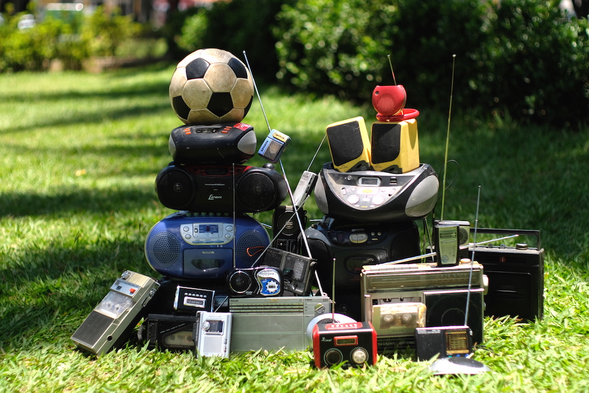

  

15 de julho de 2018. Durante 90 minutos, grande parte do planeta seguia a copa do mundo de futebol. Enquanto isso, gravávamos rádios de 60 países a narrar, cada uma à sua maneira, esse mesmo evento: Ghana, Mali, Brasil, Argentina, Polônia, Croácia, Tailândia, Bangladesh, Indonésia, Marrocos…

Escutar uma centena de vozes a comentar, juntas, as mesmas dinâmicas no campo, evidencia o que nos une e nos assemelha em um mundo globalizado. Deixando, no entanto, soar suas marcas e particularidades culturais que persistem em suas transmissões permeadas por publicidades, dedicatórias, pausas para a reza, jingles, anúncios de hora local ou músicas no intervalo.

Em uma época globalmente visual, em que estamos todos conectados às nossas telinhas e à internet, escutar a rádios talvez seja um gesto em desuso, mas o narrador de futebol não deixa de ser uma figura importante para os amantes do esporte. Essa colagem sonora tem como proposta reescutar uma história em que todos conhecemos o final, através de diversas línguas, sotaques, ritmos e melodias, muitas vezes saturadas e ao fundo ruidoso, típicos da rádio.
 

 <input id="collapsible" class="toggle" type="checkbox"><label for="collapsible" class="lbl-toggle">français</label>

 Pendant 90 minutes, le 15 juillet 2018, une grande partie de la planète a suivi la finale de la coupe du monde de football. Nous avons enregistré une soixantaine de radios qui commentaient le match à leur manière, dans le monde entier : Ghana, Mali, Brésil, Argentine, Pologne, Croatie, Thaïlande, Bangladesh, Indonésie et Maroc…   Le traitement sonore du même événement donne à entendre ce qui nous rassemble dans un monde globalisé, mais aussi les différences culturelles qui persistent. Certaines radios entrecoupent la diffusion de publicités, d’autres d’appels à la prière, de dédicaces ou de l’annonce de l’heure locale, bombardant des jingles ou de la musique à la mi-temps.   Dans une époque globalement visuelle, où nous sommes tous connectés via le petit écran et l’internet, écouter la radio semble une pratique désuète, mais le commentateur reste une figure importante pour les amateurs de football du monde entier. Ce collage sonore propose de réécouter un récit dont tout le monde connaît l’issue, à travers ses langues, ses accents, ses rythmes et ses mélodies, sur fond de grésillements et de saturations propres à la radio hertzienne.

---

 

   <iframe width="100%" height="166" scrolling="no" frameborder="no" allow="autoplay" src="https://w.soundcloud.com/player/?url=https%3A//api.soundcloud.com/tracks/547674996&color=%232057b5&auto_play=false&hide_related=false&show_comments=true&show_user=true&show_reposts=false&show_teaser=true"></iframe>

