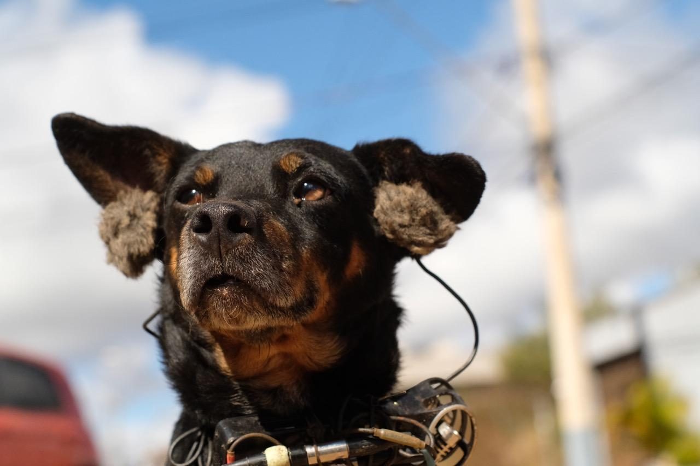

  

  
Known as “vira-latas” (dump tippers), stray dogs offer their canine listening abilities in conjunction with human cohabitation. As a dog, you love rummaging through dumpsters, looking for something to eat; you bark when a motorcycle passes by; you run after cars invading your territory; you dash in and out of houses; and you explore abandoned fields. This piece offers a ground level sonic walk, binaurally recorded by dogs in a recent urbanized neighborhood close to Belo Horizonte in Southeast Brazil.
  

 <input id="collapsible" class="toggle" type="checkbox"><label for="collapsible" class="lbl-toggle">français</label>

 Chiens de rue en binaural Connus sous le noms de “vira-latas” (retourneurs de poubelle), les chiens de rue nous proposent une écoute de leur monde canin et de leur cohabitation avec les humains. Quand on est chien, on aime fouiller dans les déchets pour y dénicher quelque chose à manger, on aboie quand une moto passe, on court autour des voitures qui envahissent notre territoire, on se faufile à l’intérieur des maisons et on explore les terrains abandonnés. Une balade sonore au ras du sol, enregistrée en binaural par des chiens d’un quartier récemment urbanisé en bordure de Belo Horizonte, au sud-est du Brésil.

---

 

   <iframe width="100%" height="166" scrolling="no" frameborder="no" allow="autoplay" src="https://w.soundcloud.com/player/?url=https%3A//api.soundcloud.com/tracks/382080137&color=%23ffb800&auto_play=false&hide_related=false&show_comments=true&show_user=true&show_reposts=false&show_teaser=true"></iframe>

 

---

 

**Direction:** Sara Lana et Félix Blume 
**Production:** [Arte Radio](https://www.arteradio.com/son/61659422/mutt_dogs){:target="_blank"} 
**Recordings:** Marmita, Pretinha, Nina, Bob and Frida 
**Press:** RTBF - [ Le docu qui a du chien ](https://www.rtbf.be/culture/pop-up/culture-web/detail_mutt-dogs-le-docu-qui-a-du-chien?id=9813632){:target="_blank"}
  
 

---

  
[Avant-Première](https://www.centrepompidou.fr/cpv/resource/crEn9k7/rXEnG8r){:target="_blank"} November 16th 2017 – Centre Pompidou
