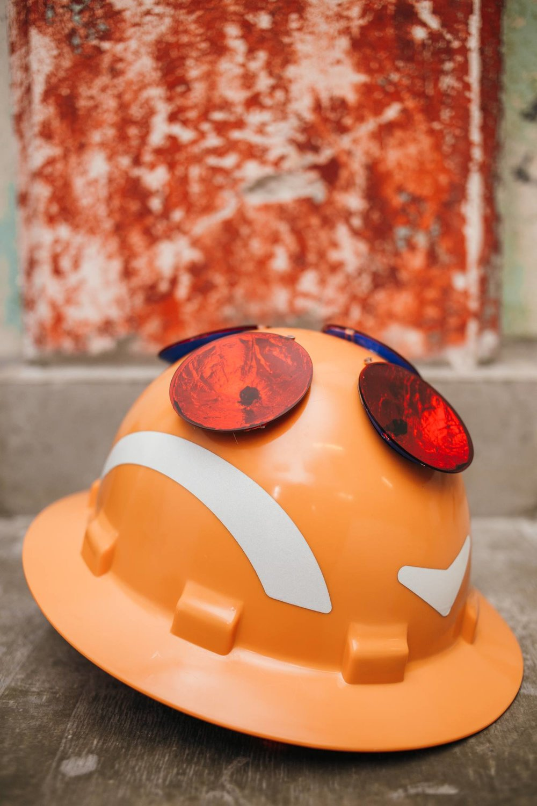
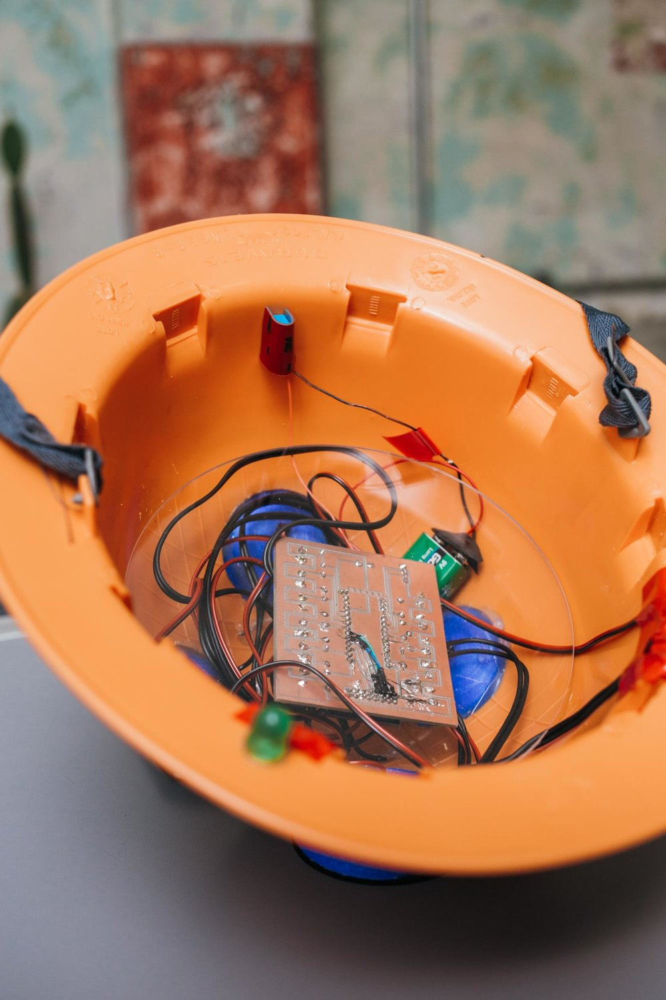
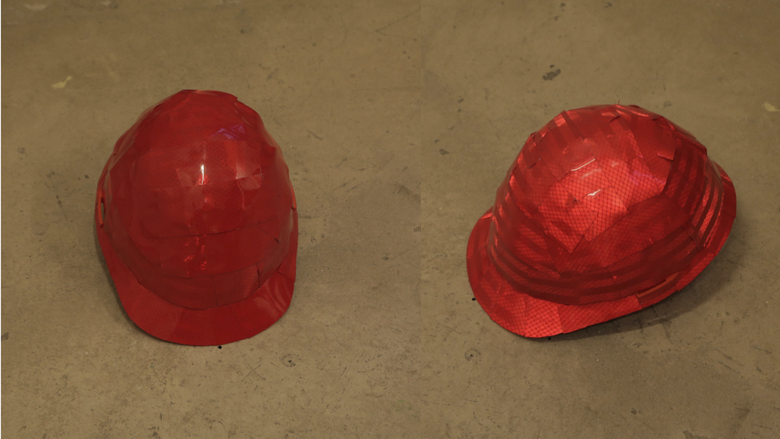
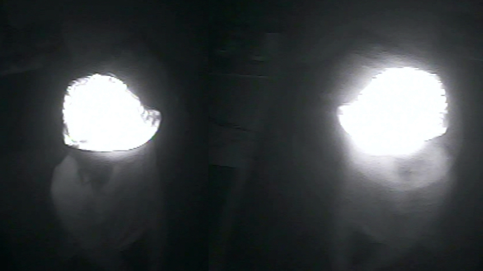
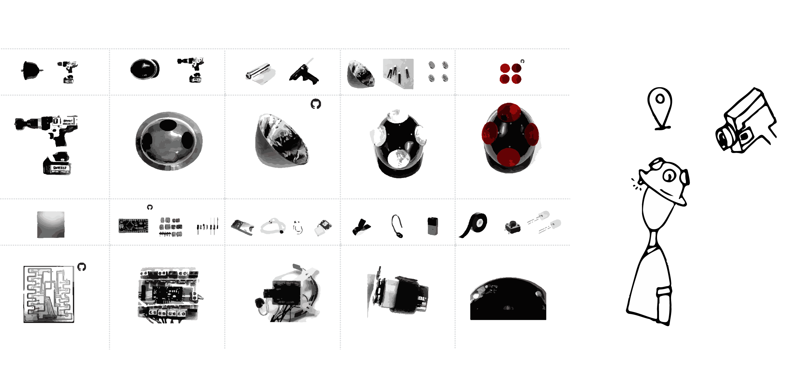
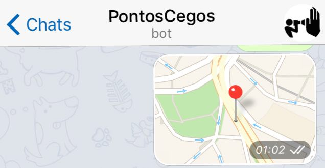

    <iframe src="https://www.youtube.com/embed/bECVsfDJvQI" frameborder="0" allow="accelerometer; clipboard-write; encrypted-media; gyroscope; picture-in-picture" allowfullscreen></iframe>

 
  

**Blind Spots** is a project which aims to create a tool of counter-surveillance. It is divided in two research approaches, Tactics of (In)Visibility:
    
**TACTICS OF VISIBILITY**
  
A helmet able to automatically detect surveillance cameras  was created. It indicates to its users when they are being filmed. This device reveals and enhances cameras which are each time more discreet and camouflaged in the cities.  
  
The device also contains a GPS and when it detects a camera, its coordinates are registered and saved on a map (see below), automatically mapping a given route.

  
 

  

    
  

  

    
  

 

**TACTICS OF INVISIBILITY – IN PROCESS**
  
A route designer is in development which is able to create routes from point A to point B, in a city, walking only by the blind spots of its cameras.
  

Here [&nbsp;a first prototype&nbsp;](../invisibility-tracer){:target="_blank"} of the invisibility route tracer.
  
 
In this line of research, I also offer <a href="../workshops" target="_blank">&nbsp;workshops&nbsp;</a> to create tools of invisibility, which are able to overshadow the registered images by surveillance cameras. 
  
 

  

    
  

  

    
  

  

---

 

           <iframe src="https://player.vimeo.com/video/232335840?autoplay=1" width="640" height="360" frameborder="0" allow="autoplay; fullscreen" allowfullscreen></iframe>

 

---

 
### MAP

  

   <iframe src="../mapa-pontos-cegos" height="200" width="300"></iframe>
  

  
  

---

 
  
### DIY | DEVICE

[github (codes, pcb e etc)](https://github.com/saralana/Pontos-Cegos){:target="_blank"}
  
[download](../assets/docs/tutorial-pontos-cegos.pdf){:target="_blank"} a brief tutorial

 

---

 

### COLLABORATE

Collaborate via Telegram, sharing the camera location with @PontosCegosBot

  

    
  

  

    
  

 

---

 