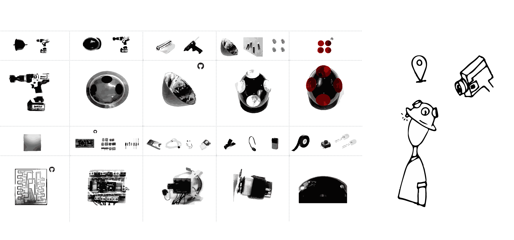
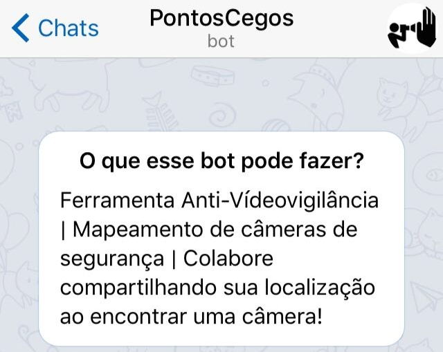

    <iframe src="https://www.youtube.com/embed/bECVsfDJvQI" frameborder="0" allow="accelerometer; clipboard-write; encrypted-media; gyroscope; picture-in-picture" allowfullscreen></iframe>

 
  

**Pontos Cegos** é um projeto que tem como objetivo criar ferramentas de contra-vigilância e é dividido em duas frentes de pesquisa, as Táticas de (In)Visibilidade: 
 
  
**TÁTICAS DE VISIBILIDADE** 
  
Foi criado um capacete capaz de detectar automáticamente câmeras de vigilância e indicar, a seus usuários, quando estão sendo filmados. Esse dispositivo revela e torna visíveis câmeras cada vez mais discretas e camufladas nas cidades. 

O aparato também possui um GPS e ao detectar uma câmera, suas coordenadas são registradas e armazenadas em um **mapa** (veja abaixo), fazendo um mapeamento automático de um dado percurso.
  

  

    
  

  

    
  

 
 **TÁTICAS DE INVISIBILIDADE | EM ANDAMENTO**
 
  Está em desenvolvimento um traçador de rotas que permite criar caminhos de um ponto A até um ponto B de uma cidade passando apenas pelos pontos cegos de suas câmeras.
 

Aqui um [primeiro protótipo](../invisibility-tracer){:target="_blank"} do traçador de rotas.
  
Também, nessa frente de pesquisa, ofereço <a href="../workshops" target="_blank">&nbsp;oficinas&nbsp;</a> para criação de ferramentas de invisibilidade, capazes de ofuscar as imagens registradas por câmeras de vigilância.
  

  

    
  

  

    
  

  

---

 

           <iframe src="https://player.vimeo.com/video/232335840?autoplay=1" width="640" height="360" frameborder="0" allow="fullscreen" allowfullscreen></iframe>

 

---

 

### MAPA

  

   <iframe src="../mapa-pontos-cegos" height="200" width="100%"></iframe>
  

  

---

 

### CONSTRUA SEU APARATO

[projeto no github (códigos, pcb e etc)](https://github.com/saralana/Pontos-Cegos){:target="_blank"}
  
[baixe aqui](../assets/docs/tutorial-pontoscegos.pdf){:target="_blank"} o passo-a-passo resumido 

 

---

 

### COLABORE 
Colabore via Telegram, compartilhando sua localização com o BOT @PontosCegosBot

  

    
  

  

    
  

 

---

 