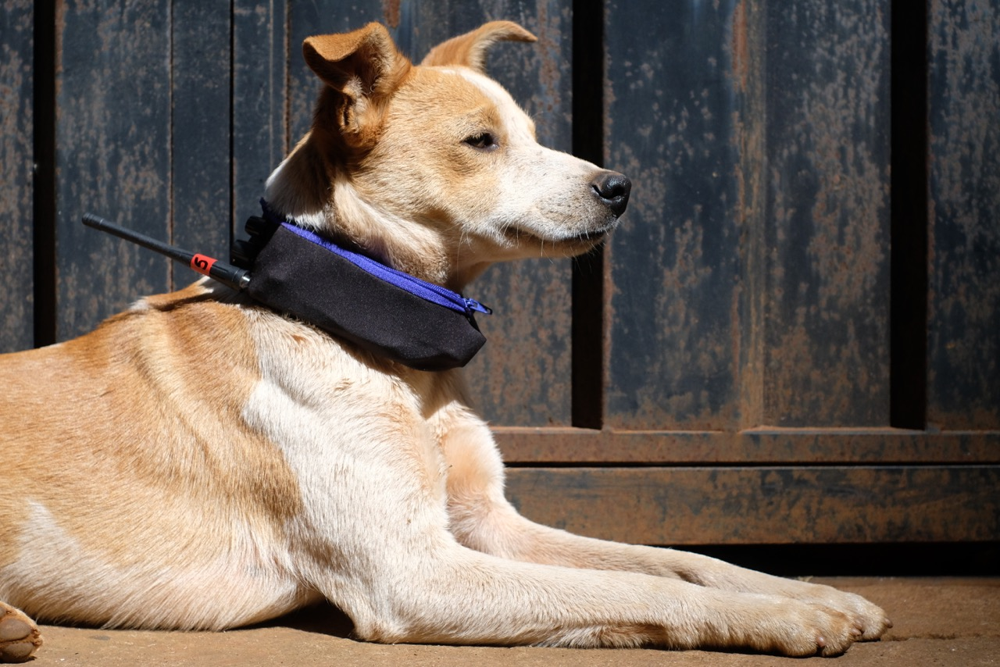

  

Pack is a canine radio recorded and transmitted by mutts. 
Radio-transmitting dog collars were created, via FM-UHF, which were able to transmit the surrounding sounds of the dogs which wore them. 
  
Based on a mobile FM_receptor it was possible to sintonize each of the dogs and to listen to them in real time, jumping from one dog to another, combining their sounds and aurally drawing a choreography of the packs of the region. 
  
Thus proportioning a spatialized listening based on the aural perspectives of the mutts in the neighborhood. 

 

---

 

['O CÃO E A CIDADE'](http://www.jaca.center/o-cao-e-a-cidade-2/){:target="_blank"} _ DANIEL TOLEDO'S TEXT ABOUT PACK PROJECT

 

---

