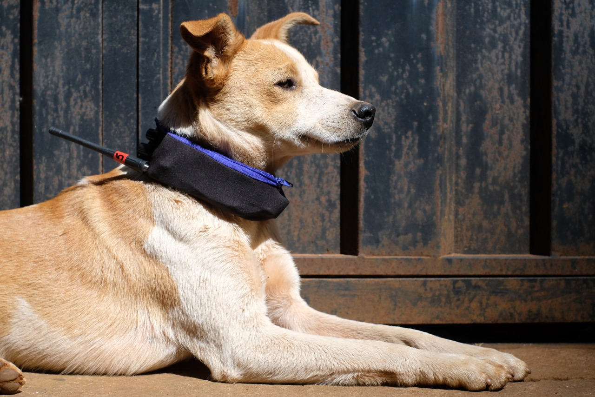

  

Matilha é uma rádio canina, gravada e transmitida por cães vira-latas.

Foram criadas coleiras radio-transmissoras capazes de transmitir, via FM–UHF, o entorno sonoro dos cachorros que as portavam.

A partir de uma estação móvel receptora_FM foi possível sintonizar-se a cada um dos cães e escutá-los em tempo real, passando de um cão a outro, combinando seus sons e desenhando, auditivamente, a coreografia das matilhas da região. 

Proporcionando, então, uma escuta espacializada a partir da perspectiva sonora dos vira-latas do bairro.

 

---

 

[CRÍTICA 'O CÃO E A CIDADE'](http://www.jaca.center/o-cao-e-a-cidade-2/){:target="_blank"} TEXTO DE DANIEL TOLEDO SOBRE A MATILHA

 

---

