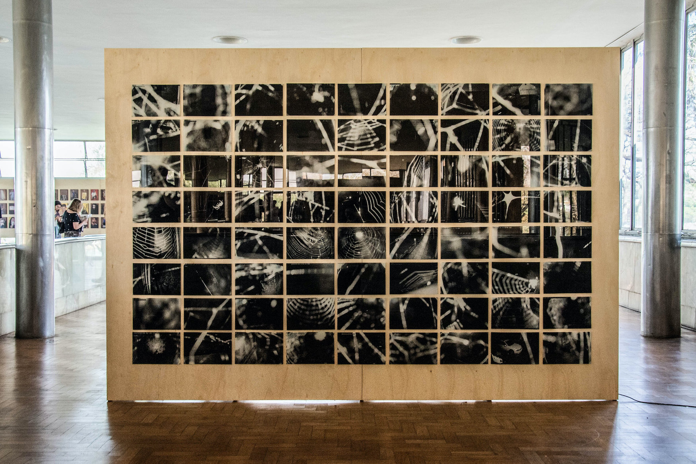

  

Species of Spaces is an investigation which is born from the appropriation of images captured by surveillance cameras. 
  
The second work of this series presents images of cameras which had its first registers obstructed by spiders, whose webs were woven in front of the devices, making them important agents of counter-vigilance. 

 

--- 

 

_**Quem cai na teia sequer se arranha. / (E a maioria dela se esquiva)**_
  
A set of images offer a view on the apparently inoffensive occupation of the spiders. An important data about these images is that they are registers carried out by domestic surveillance cameras.
  
Apparently, one spider takes up to 20 or 30 minutes to weave its web. This word, also used in English to refer to the big web which globally connects us, becomes the most critical image of this set. It is the only one capable of truly offering an idea of privacy and protection.
  
_Excerpt from the article [Viver e vigiar](../assets/docs/viver-e-vigiar.pdf){:target="_blank"} (To live and to surveil), of Hortência Abreu, published in the catalogue of Bolsa Pampulha._

 

--- 

 

    

        

        

              <iframe src="https://player.vimeo.com/video/358614507?autoplay=1" width="640" height="360" frameborder="0" allow="autoplay; fullscreen" allowfullscreen></iframe>

      

    

    

        

        

             <iframe src="https://player.vimeo.com/video/358613381?autoplay=1" width="640" height="384" frameborder="0" allow="autoplay; fullscreen" allowfullscreen></iframe>

        

    

 

 

--- 

 