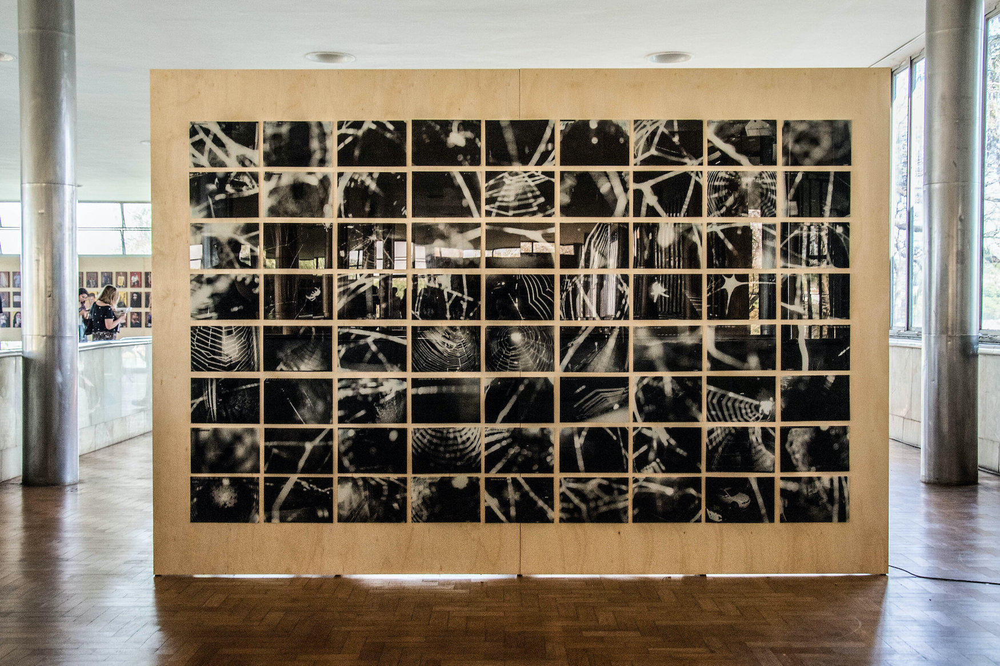

  

Espécies de Espaços é uma investigação que parte da apropriação de imagens capturadas por câmeras de vigilância.

O 2º trabalho dessa série, apresenta imagens de câmeras que tiveram seus registros inviabilizados graças às aranhas que tramaram teias na frente desses aparatos, tornando-se importantes agentes de contra-vigilância.

 

--- 

 

**Quem cai na teia sequer se arranha. / (E a maioria dela se esquiva)**
  
Um conjunto de imagens nos oferece a visão sobre a ocupação aparentemente inofensiva das aranhas. O dado importante sobre estas imagens é que elas são registros realizados por câmeras de vigilância domésticas. 
  
Aparentemente, uma aranha leva de 20 a 30 minutos para tecer sua teia. Esta, que por sinal também é a palavra em inglês usada para nomear a grande rede que nos conecta globalmente (web), torna-se a imagem mais crítica desse conjunto. É a única capaz de realmente fornecer uma ideia de privacidade e proteção.

_Trecho do artigo [Viver e vigiar](../assets/docs/viver-e-vigiar.pdf){:target="_blank"}, de Hortência Abreu, publicado no catálogo do Bolsa Pampulha._

 

--- 

 

    

        

        

              <iframe src="https://player.vimeo.com/video/358614507?autoplay=1" width="640" height="360" frameborder="0" allow="autoplay; fullscreen" allowfullscreen></iframe>

      

    

    

        

        

             <iframe src="https://player.vimeo.com/video/358613381?autoplay=1" width="640" height="384" frameborder="0" allow="autoplay; fullscreen" allowfullscreen></iframe>

        

    

 

 

--- 

 
