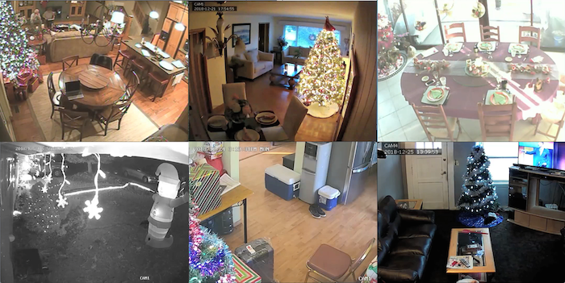

  

In a living-room in Tel Aviv, a woman sets ornaments on a table. At the same time in Bangkok a family reunites for dinner. In Houston, a man spends his afternoon wrapping presents, and in Coux, in France, an endless dinner is served to few people. All these scenes are seen on the internet, recorded by security IP cameras, used to monitor their private spaces. These images were accessed using pattern passwords established by camera producers, which often by negligence were never altered and in general are very simple: “12345” or ø.
  
During December 2018 I took advantage of this breach to observe houses of the whole world: Lonely people or entire families reunited to celebrate or spend Christmas together.

 
