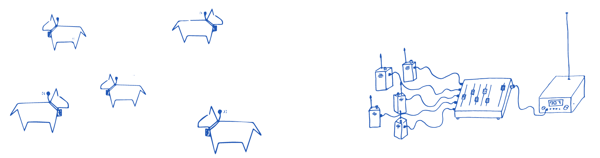
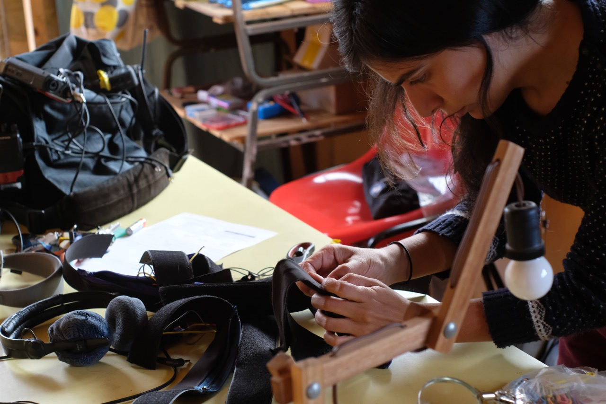
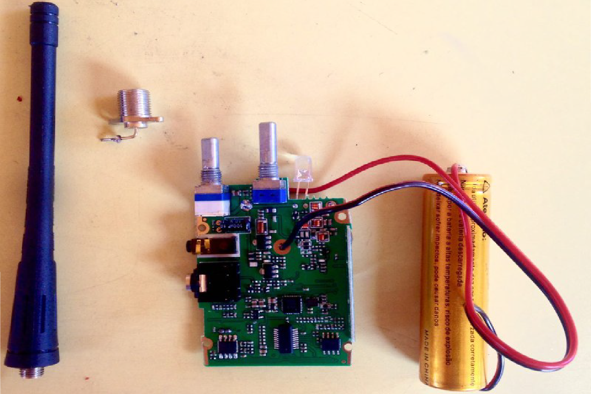
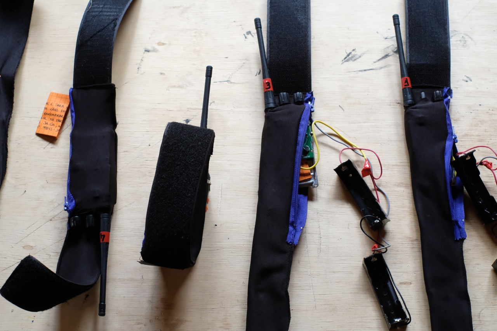
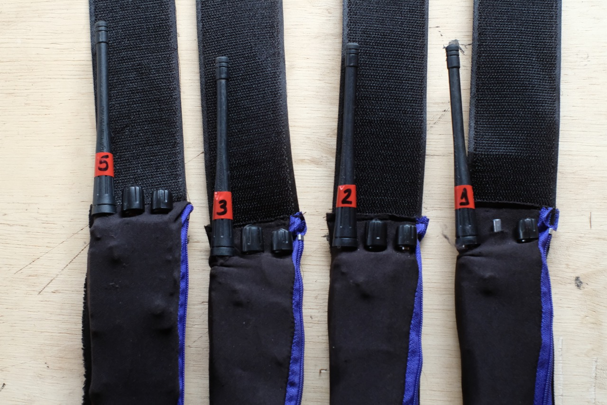

  

My proposal is to create a radio to record and transmit sounds captured by animals of Wave Farm and its neighborhoods, making possible a listenning from the auditory perspective of other species.

The collected sounds will be captured in a spatialized way, following the movement of the animals. To capture and transmit, they will use collars equipped with microphones and FM transmitters. (photos bellow) The idea is to use multiple transmitters simultaneously, making it possible to tune to each of the animals and listen to them in real time, passing from one to another, mixing their sounds and drawing a sound choreography in the region.

These animals could be dogs (saw on instagram Dash and Ivy, could be then, if they agree), caws, pigs and horses of neighboring farms, or even deers from the Catskill Mountain Park.  This will depend on creating a close relationship with them over the 10 days of residency.

The collars were created during the [Pack project](../en/matilha){:target="_blank"}, done in collaboration with mutt dogs in Brazil. As the next stage of the project, I propose that the sounds transmitted by the animals, will be combined, mixed in real time and re-transmitted on the Wave Farm's WGXC 90.7-FM radio. It is a project with two radio transmission layers: the 1st layer is a UHF transmission from the animals to the receiving station, where the sounds will be mixed in real time. The other radio layer is the result of this combination of sounds that will be transmitted on 90.7-FM.

The field recorders are the animals and I will be the technician that will mix and retransmit their sounds.
    

    

 

---

  

### radio transmitter collars

During the [Pack project](../en/matilha){:target="_blank"} I learned to reprogram and hack walkie talkies, optimize the use of batteries, and to interpret sound content (noises also carry information. Depending on their characteristics, we can even deduce the position of the transmitters in relation to the receiver). It is important to highlight that the circuit is a light and compact piece.

The transmitters were removed from powerful walkie talkies, reprogrammed for transmit-only and for operation in different frequency bands (Spectrum Allocation information below).

Depending on the animals collaborating on this project, some functions can be added to the collars: solar charger or gps. In the case of wild animals, the gps could release the transmitter collar automatically, if the animal deviates from a pre-established radius.

 

  

    
  

  

    
  

 

  

    
  

  

    
  

 

 

---

 

### Sara Lana | Artist Statement
   
  
I am a 33-year-old Brazilian artist and developer. I studied mathematics and electrical engineering at the Federal University of Minas Gerais. My projects, lie in the convergence of art, science and technology. I use multiple supports, especially sound, electronics and video, having illustration as an existing element throughout my process of creation. 
 
  
Generally speaking, my work deals with the contradictions of a society at the same time based and alienated on technology. In this context, I seek, in my work, to promote technologic disalienation. I also propose, in my projects, a reflection on the role of animals that share spaces with us. In collaboration with other species, I seek to stimulate the search for more balanced biological-technological relations.

 

---

  
 

### Workshop proposal

As part of the residency, I propose to do a workshop for constructing radio transmitter collars.

In this workshop I will teach how to hack and transform walkie-talkies for other applications, using basic electronics and programming skills. 

We will:
* interpret the circuit board and make some interventions on it
* build a programming cable using FTDI (ft232)
* getting started with CHIRP, a open-source tool for programming amateur radios.

 

---

  
 

### Here some tests I did with the radio transmitter collars:
  
