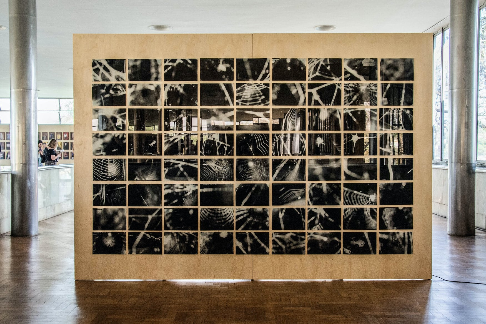
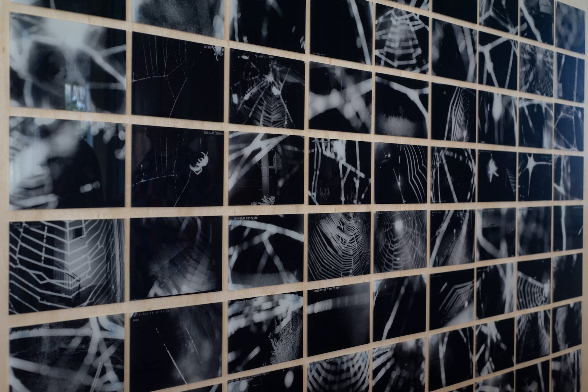

    <iframe src="https://player.vimeo.com/video/358613759?autoplay=1" width="650" height="360" frameborder="0" allow="autoplay; fullscreen" allowfullscreen></iframe>

  
  
Species of Spaces is an artistic research based on the appropriation of images captured by surveillance cameras. Installations, videos and photographic series have already been created as an outcome of this project. 
  
The second work of this series is focused on the unintended counter-surveillance role of spiders as they weave webs in front of security cameras.
  
Since 2019 I've been collecting surveillance videos of spiders woving their webs, and I propose to present this research as a video installation: multiple screens showing surveilled lives and spaces that are, little by little, been hidden and protected by spiders and their cobwebs.

 

--- 

 

    

        

        

              <iframe src="https://player.vimeo.com/video/358614507?autoplay=1" width="640" height="360" frameborder="0" allow="autoplay; fullscreen" allowfullscreen></iframe>

      

    

    

        

        

             <iframe src="https://player.vimeo.com/video/358613381?autoplay=1" width="640" height="384" frameborder="0" allow="autoplay; fullscreen" allowfullscreen></iframe>

        

    

 

 

--- 

 

A set of images shows us an apparently harmless occupation of spiders. The important thing about these images is that they are recorded by surveillance cameras from all around the world. Countless surveillance cameras lost their functionality thanks to the spiders that wove webs in front of these devices. As these arthropods use to weave their webs in the same corners where surveillance cameras are normally placed, they have become important counter-surveillance agents, ensuring some privacy for over-monitored humans.
  
Focused on the interaction between physical bodies (spiders), technological bodies (cameras) and cultural bodies (surveillance), I've been collecting, since 2019, spider webs images from surveillance cameras archives. 
  
For the Tracked & Traced exhibition I propose to create a video installation with dozens of videos of webs hiding surveillance cameras recordings.  

I [first presented](../en/especies-de-espacos-2){:target="_blank"} this research as a digital printing installation.  For the Tracked & Traced, the idea is to create a video grid, with a hundred of 7"inches screens, each one showing a different place in the world. Each video will reveal a web being waved, from the beginning,  in front of the cameras, until the images shown before can no longer be identified.
  
The screens could be digital picture frame screens. They have 7" inches and I've done a lot of experiments hacking these devices.
Here some tests I've done:

 

    

      
    

    

        

            

            <iframe src="https://player.vimeo.com/video/508945366?autoplay=1" width="640" height="384" frameborder="0" allow="autoplay; fullscreen" allowfullscreen></iframe>

        

    

 

Some photos of the 1st exhibition:
  

    

      
    

    

        

            
        

    

  

Apparently, one spider takes up to 20 or 30 minutes to weave its web. This word, also used in English to refer to the big web which globally connects us, becomes the most critical image of this set. It is the only one capable of truly offering an idea of privacy and protection.
  
The archive of images generated by surveillance cameras has immeasurable proportions and stores videos that are not made for public viewing. However, this work recognizes the poetic potential of these records, which are also impregnated with strong characteristics of our time and thus consolidate a relevant testimony for the construction of the narrative of our present history.

  
 

---

 

This project is part of a broader research on video surveillance that I have been developing since 2015. I understand it as the confluence of two major projects:  The series **Species of Spaces** and the **Blind Spots Project**.
  
[Blind Spots ](../en/pontos-cegos){:target="_blank"} is a project which aims to create counter-surveillance tools.

I created a helmet able to automatically detect surveillance cameras. It indicates to its users when they are being filmed. This device reveals and enhances cameras which are each time more discreet and camouflaged in the cities.
  
The device also contains a GPS and when it detects a camera, its coordinates are registered and saved on a map (see below), automatically mapping a given route.
  
A route designer is in development which is able to create routes from point A to point B, in a city, walking only by the blind spots of its cameras.

  
 

---

 

### Submitter Bio
    
Sara Lana is a 33 year-old Brazilian artist and developer. She was born in Belo Horizonte (Brazil), studied Mathematics and Electric Engineering in the Federal University of Minas Gerais. Her projects lie in the convergence of art and technology. She often uses varied supports, especially sound, electronics and video, having illustration as an existing element throughout her process of creation.
  
Her work seeks to promote technologic disalienation by calling attention to our detachment to the omnipresence of digital machines in our contemporary society. Besides offering insights on the role of the animals which share space with humans, her work also offers and stimulates the search for more balanced relations with them in our current technologic context.
  
Sara is also executive director of  Silo – Art and Rural Latitude , a Civil Society Organisation of Public Interest dedicated to fostering and publicising cultural projects in rural areas, with the aim of bringing about transdisciplinary exchange between different areas – above all art, science and technology – and stimulating exchange between intuitive techniques and scientific knowledge.
  
 

---

 