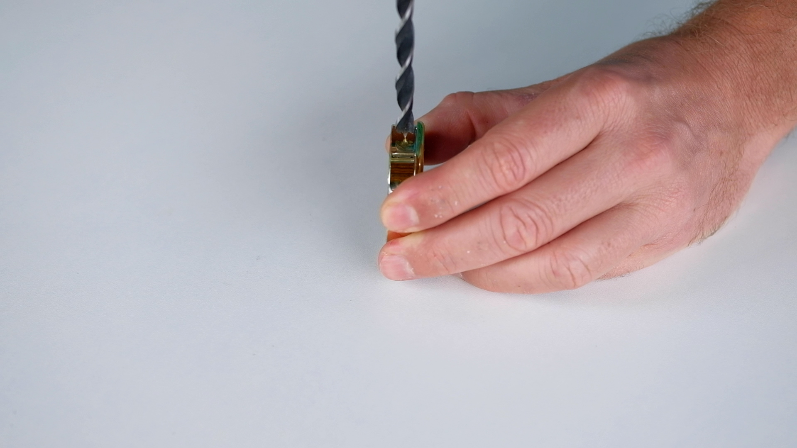
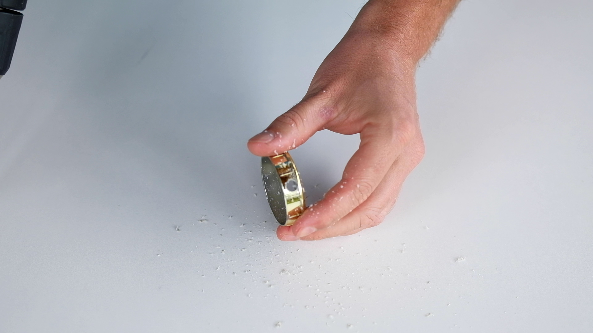
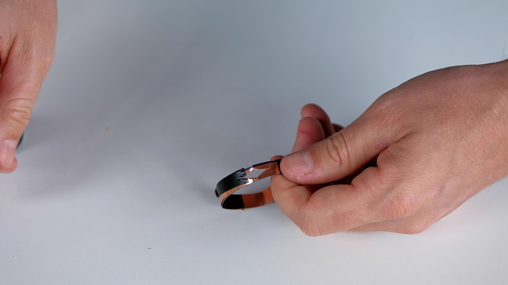
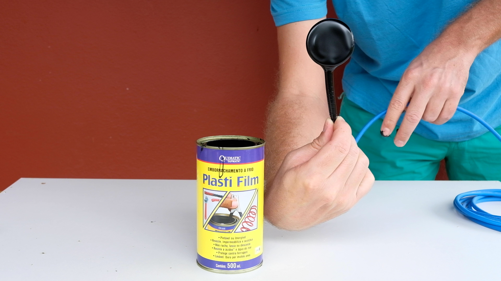
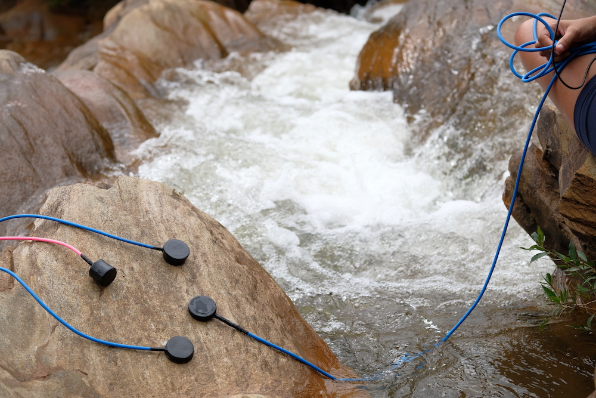

<iframe src="https://www.youtube.com/embed/C3Sm4YkPF9w" frameborder="0" allow="accelerometer; autoplay; clipboard-write; encrypted-media; gyroscope; picture-in-picture" allowfullscreen></iframe>

    

## construa seu hidrofone seguindo os passos abaixo:

 

 

  

     

      <b>Materiais:</b>  
         1. cabo para microfone (mono) 
         2. termoretrátil 
         3. sensor piezoelétrico (usamos no vídeo um piezo de 1") 
         4. Tampinha de plástico ou pézinho de borracha  (diâmetro ~ 1cm maior que o piezo) 
         5.  plug p10  
         6.  arruelas  
         7.  borracha líquida  
         8.  folha de cobre  
         9.  estanho  
         10. silicone  
         11. fita isolante  
      

   

    

          

        <b>Ferramentas:</b>  
        1. Estilete 
        2. Tesoura 
        3. Furadeira 
        4. Broca  
        5. Serra copo (com um diâmetro um pouco menor do que o piezo)   
        6.  Alicate de corte / decapador 
        7.  Ferro de solda 
        8.  Régua  
        9.  Caneta permanente 
        10. Isqueiro  
      

    

 

---
 
  
## etapa 1: preparação da tampinha

 

  

     
           
      
       
   

    

        
           
        
    

* Escolha uma tampinha 1cm maior que seu piezo. No vídeo usamos um piezo de 27mm e uma tampinha de 40mm.
  
* Com uma régua marque o centrro da tampinha.
  
* Usando uma serra-copo, faça um furo na tampa.
(o diâmetro da serra-copo deve ser um pouquinho menor do que o piezo)
  
* La lateral da tampinha, com uma broca de de 50mm faça outro furo. É por esse buraco que passaremos o cabo do mic.

  

---
 
  
## etapa 2: folha de cobre

 

  

     
           
      
       
   

    

        
           
        
    

Usaremos o cobre para reduzir interferências.
  
* Meça a altura da tampinha
  
* Corte a folha de cobre em uma tira com a mesma altura da tampinha.
  
* Faça um anel com a tira e envolva a tampinha internamente com essa camada de cobre
  
* Use fita isolante para fixar a tira de cobre na tampinha

* Usando uma tesoura faça um furo nessa tira para a passagem do cabo.
Obs: exite uma folha de cobre mais fina, tipo folha de aluminio, que pode ser melhor para esse processo.
  
  

---

 
  
## etapa 3: piezo e solda do cabo

 

  

     
           
      
       
   

    

        
           
        
    

* Posicione o piezo centrado na parte externa da tampinha. O terminal cerâmico deve ser visto por dentro do furo feito com serra-copo.
  
* Fixe o piezo com fita isolante (que será posteriormente retirada na etapa 5).
  
* Antes de soldar, coloque termoretratil em ambas vias do cabo, bem como no cabo do mic.
  
* Passe o cabo no furo lateral da tampinha e do cobre e sode ambas as vias.
  
* Solde o plug p10 na outra ponta do cabo.
  
* Depois de soldar, posicione o termoretátil nos terminais expostos e aquce com isqueiro ou soprador térmico. 
**Obs:** é possível usar um cabo estereo. Nesse caso você deve soldar o GND no revestimento de cobre.
  
  

---

 
  
## etapa 4: silicone e arruelas

 

  

     
           
      
       
   

    

        
           
        
    

* Preencha a tampinha com silicone
  
* Coloque 2 arruelas dentro da tampa e preencha o restante com silicone.
  
* Corte um circulo de cobre com o mesmo diâmetro da tampinha.
  
*  Coloque o círculo de cobre no topo do preenchimento de silicone para que grude.

* Espere até que o silicone seque (~33min) 
**Obs:** Você pode colocar um peso por cima do circulo de cobre para garantir sua aderência na peça. 
  
  

---

 
  
## etapa 5: borracha líquida

 

  

     
           
      
       
   

    

        
           
        
    

* Cudadosamente retire a fita isolante do piezo.
  
* Mergulhe a tapinha na borracha líquida e retire bem devagar.
  
* Deixe secar por ~31 minutos e repita o mergulho 2 ou 3 vezes.
  
* Para uma camada uniforme de emborrachado, vire seu hidrofone de cabeça para baixo enquanto ele seca.
  
  

--- 

 

## etapa 6: Escuta
  
Experimente seu hidrofone e compartilhe suas gravações !!
  
  

--- 

 

## tutorial feito por sara lana & félix blume ##
 

  
Outros tutoriais interessantes que nos ajudaram a construir nosso hidrofone:

*  [Phase 57](http://www.phase57.com/build/contact-mic){:target="_blank"} give a very similar way of building a contact microphone, shield as ours, and I guess that could easily be used as a hydrophone 

* [Zach Poff](https://www.zachpoff.com/resources/building-contact-mics){:target="_blank"} give a step by step building of a contact mic in a very easy way. With an interesting list of other places to buy some contact mic online (at the bottom of the page) 

* [John Grzinich](https://maaheli.ee/main/d-i-y-hydrophones){:target="_blank"} share here a nice way to build a DIY hydrophone 

* [Guillaume Leguen](https://wikifactory.com/@gheleguen/hydrophone){:target="_blank"}

* [Locus Sonus – Grégoire Lauvin](https://locusonus.org/wiki/index.php?page=Hydrophone.en){:target="_blank"}

* [David Dunn](https://www.zachpoff.com/site/wp-content/uploads/David-Dunn-Microphones_Hydrophones_Vibration-Transducers__Rolling_Your_Own__Dunn2007.pdf){:target="_blank"}

* [LOM contact microphone and interesting things about piezo](https://knowledge.lom.audio/research/contact_mics){:target="_blank"}

* [Tim Prebble about contact microphone](http://www.musicofsound.co.nz/blog/the-first-rule-of-contact-mic-club){:target="_blank"}
 
 

Se você quer comprar um hidrofone, aqui algumas indicações :

* [Aquarian](https://www.aquarianaudio.com/){:target="_blank"} is one of the famous constructor of very good and cheap hydrophones, already very famous 

* [Dolphin Ear](http://www.dolphinear.com/){:target="_blank"} is doing very good hydrophones too (a bit more expensive)
 

* [Cold Gold](https://contactmicrophones.com/index.html){:target="_blank"} has a lot of different models of contact mic and hydrophone, at very good prices (including some piezo and copper foil for DIY mic) 
 
* [Jez Riley French](https://jezrileyfrench.co.uk/ordering-page.php){:target="_blank"} is doing and selling a few models of contact and hydrophone since a long time now (at a good price too)  
  
* [Crank Sturgeon](https://www.etsy.com/shop/CrankSturgeon){:target="_blank"} sells different models of contact mic (some are waterproof) done by himself
  
* [Monkey Sound](https://www.etsy.com/fr/shop/MonkeySound){:target="_blank"} is doing and selling a few nice models too
  
* [Geophone by LOM Audio](https://store.lom.audio/products/geofon){:target="_blank"}. It is not an hydrophone, but it’s a very nice tool for contact recording 

* [Ambient](https://ambient.de/en/product_custom_cat/underwater-en/){:target="_blank"} sells ones of the best hydrophones, but with a much higher price 
    

Se você tem algum outro tutorial para sugerir ou uma boa opção de hidrofone à vensa, nos escreva!
  
[https://saralana.xyz/about](https://saralana.xyz/about){:target="_blank"} & [https://felixblume.com/contact](https://felixblume.com/contact){:target="_blank"}