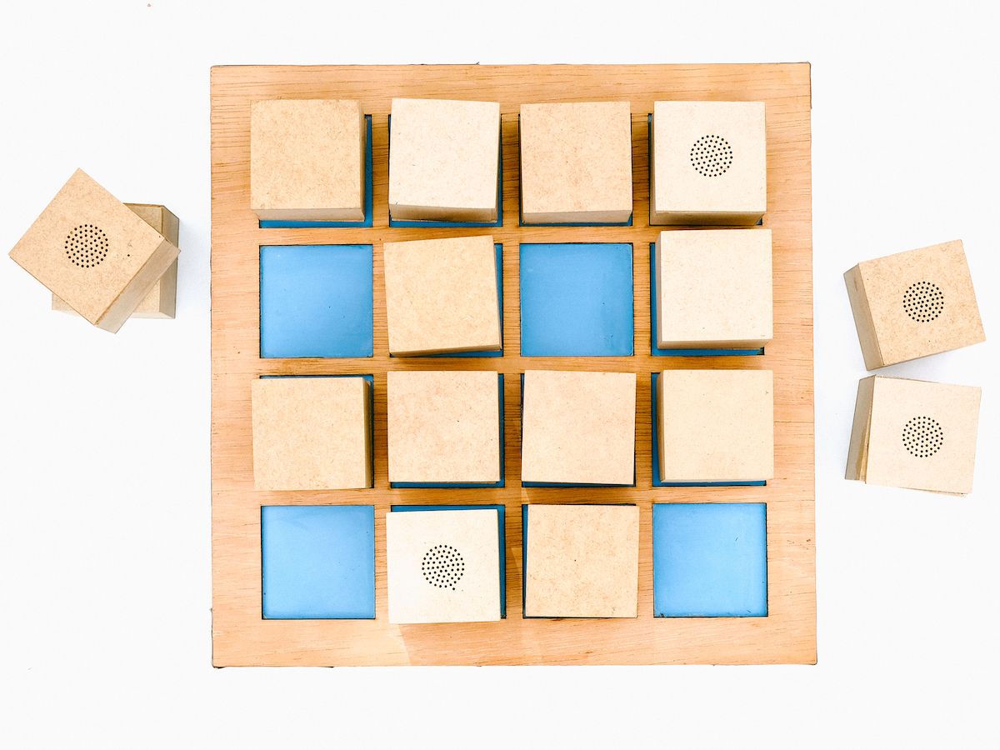

 
 
Se usan cubos que suenan cuando se voltean, revelando cada uno el sonido que esconden. Un mismo sonido está presente en 2 cubos distintos, y el objetivo es encontrar los pares idénticos.
 
 

<iframe src="https://player.vimeo.com/video/512180495?title=0&byline=0&portrait=0" style="position:absolute;top:0;left:0;width:100%;height:100%;" frameborder="0" allow="autoplay; fullscreen; picture-in-picture" allowfullscreen></iframe>

  

Los sonidos presentes en los cubos son grabados durante un taller de grabación de sonido, dirigido a niño/as. De la misma manera, el juego está construido colectivamente, durante un taller de electrónica.
 
La cantidad y el tamaño de los cubos es definida durante el proceso. 
Los cubos están dispuestos sobre una base de alimentación inalámbrica.

 

---

 

  

     

      <b>ETAPA 1 | Grabación</b>  
Los participantes aprenden el manejo de grabadoras, micrófonos y audífonos. Varios ejercicios los familiarizan con el equipo y la escucha de los sonidos de su entorno. Juntos seleccionamos los sonidos que hacen parte del juego y que dibujan un paisaje sonoro de su cotidiano.
      

   

    

          

<b>ETAPA 2 | Construcción</b>  
En un taller de electrónica, cada uno de los participantes construye 2 cubos del juego. Son hechos de: 1 circuito reproductor mp3,  1 receptor de carga inalambrico (QI) y 1 parlante. El dispositivo se monta en un cubo de madera.  
Las piezas son pre fabricadas facilitando su manejo por los niños. 
      

    

    

          

<b>ETAPA 3 | Finalización</b>  
Varias combinaciones y volúmenes de los sonidos son probadas para definir la configuración sonora final del juego.
      

    

 
 
## !A jugar!
 
 
 
---

 

[descarga aquí el pdf del proyecto](../assets/docs/juego-de-memoria.pdf){:target="_blank"} 

 
 
---

 

Algunas imágenes del proceso de construcción del prototipo.: