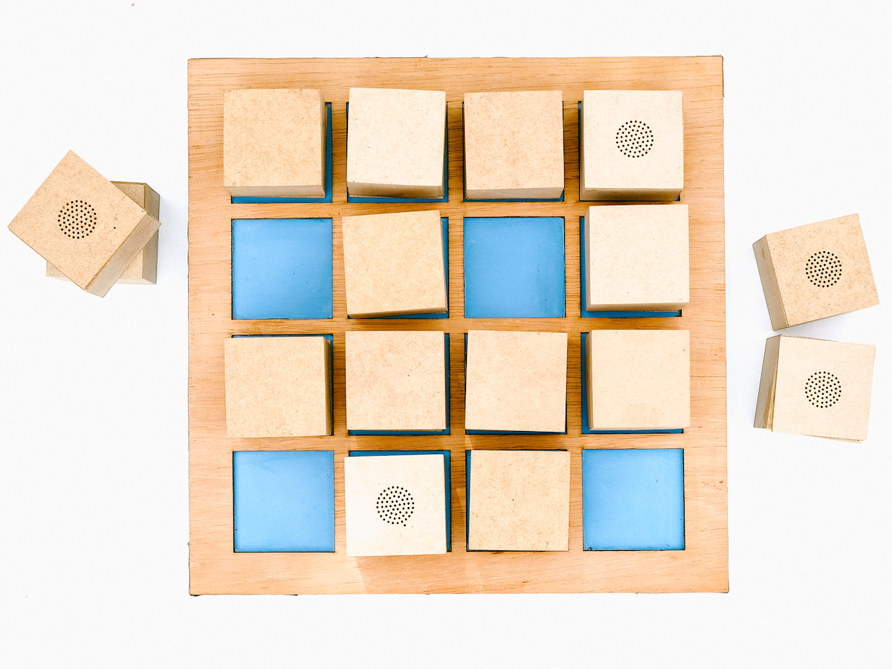

 
 
Usamos cubos que soam quando são virados, revelando, cada um, o som que escondem. O mesmo som está presente em 2 cubos diferentes e o objetivo é encontrar os pares idênticos.
 
 

<iframe src="https://player.vimeo.com/video/512180495?title=0&byline=0&portrait=0" style="position:absolute;top:0;left:0;width:100%;height:100%;" frameborder="0" allow="autoplay; fullscreen; picture-in-picture" allowfullscreen></iframe>

  

Os sons presentes nos cubos são gravados durante uma oficina de gravação, voltada para crianças. Da mesma forma, o jogo é construído coletivamente, durante uma oficina de eletrônica.
 
A quantidade e o tamanho dos cubos são definidos durante o processo.
Os cubos são dispostos em uma base de alimentação sem fio.

 

---

 

  

     

      <b>ETAPA 1 | GRAVAÇÃO</b>  
Os participantes aprendem a usar gravadoras, microfones e fones. Vários exercícios os familiarizam com o equipamento e com a escuta dos sons de seu entorno. Juntos, selecionamos os sons que fazem parte do jogo e que desenham uma paisagem sonora de seu cotidiano.

      

   

    

          

<b>ETAPA 2 | CONSTRUÇÃO</b>  
Em uma oficina de eletrônica, cada um dos participantes constrói 2 cubos do jogo: 1 circuito de mp3 player, 1 receptor de carregamento sem fio (QI) e 1 alto-falante. O dispositivo é montado em um cubo de madeira. 
As peças são pré-fabricadas facilitando o manuseio pelas crianças.
      

    

    

          

<b>ETAPA 3 | FINALIZAÇÃO</b>  
Várias combinações e volumes de sons são testados para definir a configuração sonora final do jogo.
      

    

 
 
 
 
---

 

[baixe aqui o pdf do projeto](../assets/docs/jogo-da-memoria.pdf){:target="_blank"} 

 
 
---

 

Algumas fotos do processo de contrução do protótipo: