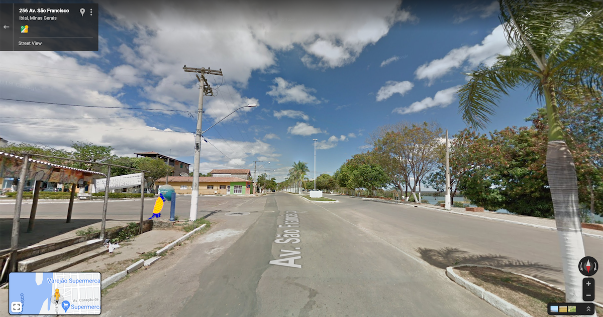

Viajo ao longo das margens de rios utilizando ferramentas para visualização panôramica de espaços públicos e de imagens de satélite. Um trajeto percorrido à procura de orelhões,  verdadeiros pontos de escuta espacializados no curso desses rios.

Cruzando as coordenadas geográficas identificadas no trajeto com informações coletadas no banco de dados da Agência Nacional de Telecomunicações (Anatel), consigo resgatar o número de cada telefone público anteriormente identificado nas beiras dos rios.

Começo então uma série de chamadas para destinatários ainda desconhecidos ou até mesmo inexistentes. Linhas cruzadas na tentativa de escutar um pouco a vida que se passa ao redor e os contrastantes cenários que contornam um mesmo rio. 
Enquanto correm risco de extinção em boa parte do estado, os orelhões ainda são o único meio de comunicação em povoados ribeirinhos que não tem cobertura de telefonia móvel. 
  

---

 

### TELEFONES JÁ RASTREADOS 
(ainda não subi os áudios das chamadas)
  
  

   <iframe src="../mapa-orelhinha" height="200" width="100%" style="border:0px"></iframe>
  

  

---
 
  
 

### BUSCA
 

  

    
      
            
      
    
  

  

---
   
 

### RABISCANDO AO TELEFONE

  

    
      
            
      
    
  

  

---
 

  

    
      
            
      
    
  

*fotos Clarice Rodrigues*
  

---

 

  

---

 
### DADOS ABERTOS SOBRE AS ÁGUA
 
No site da ANA, Agência Nacional de Água estão disponíveis para download dados abertos sobre as águas do Brasil.

Esgotos, saneamento, bacias hidrográficas e etc.

<a href="https://dados.gov.br/organization/agencia-nacional-de-aguas-ana" target="_blank">https://dados.gov.br/organization/agencia-nacional-de-aguas-ana</a>

 

  
---
  
  
 

### BASE MAPA FITA KRAFT
 
Testes para aplicar como fundo do mapa.
 
  

    
      
            
      
    
  

  