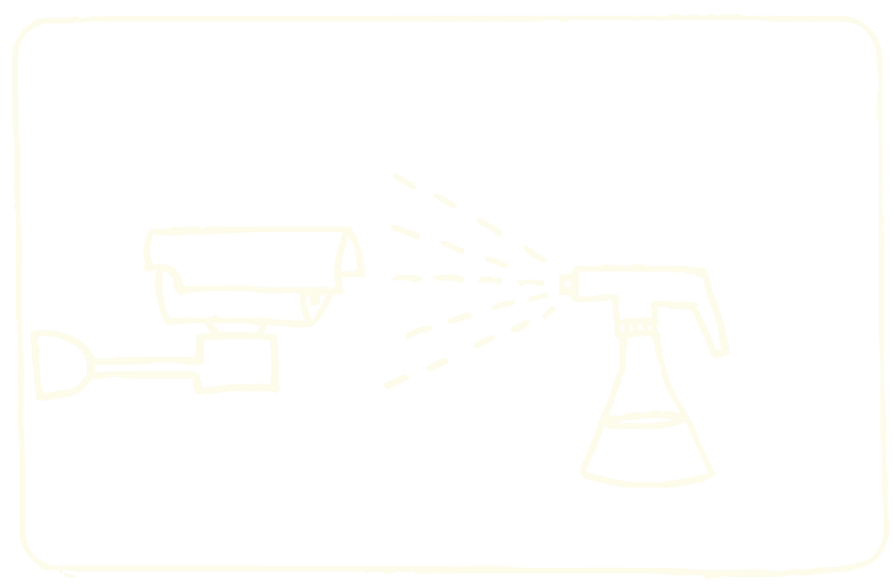
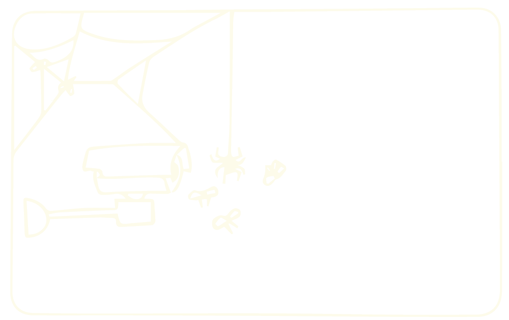

    <iframe src="https://player.vimeo.com/video/358613759?autoplay=1" width="650" height="360" frameborder="0" allow="autoplay; fullscreen" allowfullscreen></iframe>

  
  
Species of Spaces is an artistic research based on the appropriation of images captured by surveillance cameras. Installations, videos and photographic series have already been created as an outcome of this project. My proposal for the **Web Residency No 16 | Solidarity is a verb** is to start a new stage of this research, focusing on the unintended counter-surveillance role of spiders as they weave webs in front of security cameras.
The investigation will be carried out with the collaboration of local spiders and scientists. My intention is to produce a video exhibition and a small publication with the research results during the residency.

A set of images (bottom) shows us an apparently harmless occupation of spiders. The important thing about these images is that they are recorded by surveillance cameras from all around the world. Countless surveillance cameras lost their functionality thanks to the spiders that wove webs in front of these devices. As these arthropods use to weave their webs in the same corners where surveillance cameras are normally placed, they have become important counter-surveillance agents, ensuring some privacy for over-monitored humans.

Although these spiders unintendedly help humans with their webs, the interaction with surveilled people doesn’t benefit or harm the arthropods. In the following steps, I propose some actions that aim to reconfigure this biological interaction so that spiders would also benefit from building their webs in front of cameras:

* Constantly monitor cameras online, recording spider webs being woven;

* Investigate, with the collaboration of scientists, possible interventions in the cameras that might benefit spiders.
As an example, attracting more preys through injected pheromones;

* Make tests placing modified cameras in order to attract insects and spiders;

* Search online for open access cameras near Arcus and find the location of these cameras, based on the recorded landscape;

* Modify, without damaging, those cameras with the actions defined during the previous experiments.

Following that investigation, I will create a multiple screen video installation of webs being woven by spiders. I also intend to create an illustrated manual for a proto-cooperative spider-camera-human relation - a relation that breaks boundaries between physical bodies (spiders), technological bodies (cameras) and cultural bodies (vigilance).

Interestingly, the word “web” is also used to name the large network that connects us globally: the world wide web. All the scenes mentioned before are available on the Internet, from IP cameras. (Surveillance videos featuring spiders: attached_videos).

 

 

    

        

        

              <iframe src="https://player.vimeo.com/video/358614507?autoplay=1" width="640" height="360" frameborder="0" allow="autoplay; fullscreen" allowfullscreen></iframe>

      

    

    

        

        

             <iframe src="https://player.vimeo.com/video/358613381?autoplay=1" width="640" height="384" frameborder="0" allow="autoplay; fullscreen" allowfullscreen></iframe>

        

    

 

 

 

## Note about biological interactions

Considering the relationship between spiders and surveilled humans as an interspecific biological interaction, it’s possible to argue that the current interaction is a kind of commensalism: interaction in which members of one species gain benefits while those of the other species neither benefit nor are harmed. In this case, surveilled humans benefit from the protection of the webs, but the spiders don’t benefit from weaving their webs specifically in front of the cameras.

I propose to transform this interaction in order to ensure that spiders would also benefit from it. Ideally, I aim to shift the biological interaction from commensalism to protocooperation, which is an advantageous interaction for both species. 

Biological interactions reference: 
Witzany, G. (2000) Life: The Communicative Structure)

  
 

---

 

## In process

    

      
Species identification with collaboration of biologists Pedro Martins and Alexandre Stamato Michelotto. Species recognition is carried out based on the study of behavior, geographic location and web patterning. Some arachnid families have already been raised, such as: Araneidae, Theridiidae, Uloboridae.
      

      
       
      (Some examples of webs from these families can be seen on the side. They are categorized as orbicular suspended webs)
      

      
    

    

      
        
      
With the collaboration of other scientists, I'm mapping possible interferences on cameras that could benefit and attract spiders. Like, for example, creating a pheromone scent to attract insects. By spraying it on the cameras, more insects would approach and thus the spiders would have a guaranteed feast.

         
      
I'm already testing some interferences: experimental application to evaluate the effectiveness of the insertion of scents and lights to attract insects and spiders.

    

 

    

      
    

    

      
    

    

      
    

 

---

 

## Next steps

* Application and prototyping positioning in the streets, cameras already interfered to attract insects and spiders;
computer.001.jpg

* Search, online, for more cameras with free access in Belo Horizonte.

* Determine the geographic location of the cameras from the captured image (streets, landscapes) and the crossing of online access information (IP number).

* Intervene in cameras previously installed in the city, with actions defined experimentally.

**NOTE:** As in the example above, I seek discreet or invisible interventions that do not damage the cameras.

 

---

 

## Research and previous works

I [first presented](../en/especies-de-espacos-2){:target="_blank"} this research as a digital printing installation.  

Some photos of the 1st exhibition:
  

    

      
    

    

        

            
        

    

  
This project is part of a broader research on video surveillance that I have been developing since 2015. I understand it as the confluence of two major projects:  The series **Species of Spaces** and the **Blind Spots Project**.
  
[ Blind Spots ](../en/pontos-cegos){:target="_blank"} is a project which aims to create counter-surveillance tools.

I created a helmet able to automatically detect surveillance cameras. It indicates to its users when they are being filmed. This device reveals and enhances cameras which are each time more discreet and camouflaged in the cities.
  
The device also contains a GPS and when it detects a camera, its coordinates are registered and saved on a map (see below), automatically mapping a given route.
  
A route designer is in development which is able to create routes from point A to point B, in a city, walking only by the blind spots of its cameras.

  
 

---

 

## Bio
    
**Sara Lana** is a 33 year-old Brazilian artist and developer. She was born in Belo Horizonte (Brazil), studied Mathematics and Electric Engineering in the Federal University of Minas Gerais. Her projects lie in the convergence of art and technology. She often uses varied supports, especially sound, electronics and video, having illustration as an existing element throughout her process of creation.
  
Her work seeks to promote technologic disalienation by calling attention to our detachment to the omnipresence of digital machines in our contemporary society. Besides offering insights on the role of the animals which share space with humans, her work also offers and stimulates the search for more balanced relations with them in our current technologic context.
  
Sara is also executive director of [ Silo – Art and Rural Latitude ](../en/pontos-cegos){:target="_blank"}, a Civil Society Organisation of Public Interest dedicated to fostering and publicising cultural projects in rural areas, with the aim of bringing about transdisciplinary exchange between different areas – above all art, science and technology – and stimulating exchange between intuitive techniques and scientific knowledge.
  
 

---

  

## References

* Fritz Vollrath and Paul Selden - The Role of Behavior in the Evolution of Spiders, Silks, and Webs - 2007 - link para download

* Blackledgea,1, Nikolaj Scharffb, Jonathan A. Coddingtonc, Tamas Szu ̈ tsb, John W. Wenzeld, Cheryl Y. Hayashie, and Ingi Agnarssona - Reconstructing web evolution and spider diversification in the molecular era Todd A. - 2009 - link para download

* Witzany, G. (2000) Life: The Communicative Structure. Norderstedt, Libri.

 