
<iframe src="https://youtube.com/embed/5RfPWc047o8" frameborder="0" allow="accelerometer; autoplay; clipboard-write; encrypted-media; gyroscope; picture-in-picture" allowfullscreen></iframe>

  

> <b>Plataformas:</b> 
         1. [uMap](http://umap.openstreetmap.fr/en/){:target="_blank"}  
         2. [freesound](https://www.freesound.org/){:target="_blank"} , [soundcloud](https://www.soundcloud.com/){:target="_blank"} , [spotify](https://www.spotify.com/){:target="_blank"} , [archive](https://www.archive.org){:target="_blank"} , [google drive](https://www.drive.google.com){:target="_blank"} or any other cloud, repository or streaming platform  
         3. [Google Sheets](https://docs.google.com/spreadsheets/){:target="_blank"}  
  

---

 
  
## passo 1: Faça upload dos seus sons para um repositório ou plataforma de streaming

 

 

* Nesse tutorial vamos construir o mapa com sons publicados no [freesound.org](https://www.freesound.org/){:target="_blank"} 

  

---
 
  
## passo 2: Crie uma planilha no google spreadsheet com os seus sons 

 

  

     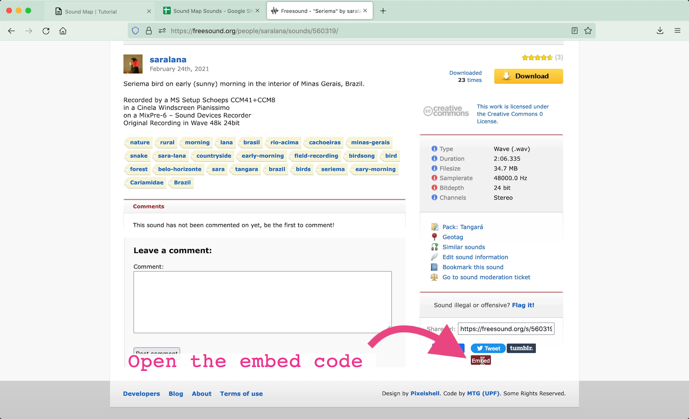
   

    

        
    

 

* É importante que a planilha tenha ao menos duas colunas nomeadas como "Latitude" e "Longitude"

* As coordenadas devem ser inseridas no **SISTEMA DECIMAL**
> <u>ex.</u>: -20.11148255	-43.72861216

* Outra coluna deve conter um link incorporável para seus sons (embed).

* Você não deve copiar todo o código incorporável (embed), mas apenas o link que aparece entre aspas após "src="
 

* **NO FREESOUND** o código incorporável é  
> <b><em><iframe frameborder="0" scrolling="no" src="</em><em style="background-color:#ffdf3b;">https://freesound.org/embed/sound/iframe/560319/simple/small/</em><em>"width="375" height="30"></iframe></em></b>
  
> E o link que deverá ser copiado e colado na planilha é
 
> <b><em style="background-color:#ffdf3b;">https://freesound.org/embed/sound/iframe/560319/simple/small/</em></b>
  

* **NO SOUNDCLOUD** o código incorporável é 
> <b><em><iframe width="100%" height="166" scrolling="no" frameborder="no" allow="autoplay" src="</em><em style="background-color:#ffdf3b;">https://w.soundcloud.com/player/?url=https%3A//api.soundcloud.com/tracks/1011674683&color=%23ff43ad&auto_play=false&hide_related=false&show_comments=true&show_user=true&show_reposts=false&show_teaser=true</em><em>"></iframe></em></b>
  
> E o link que deverá ser copiado e colado na planilha é
 
> <b><em style="background-color:#ffdf3b;">https://w.soundcloud.com/player/?url=https%3A//api.soundcloud.com/tracks/1011674683&color=%23ff43ad&auto_play=false&hide_related=false&show_comments=true&show_user=true&show_reposts=false&show_teaser=true</em></b>

  

---
 
  
## passo 3: configure as células da planilha

 
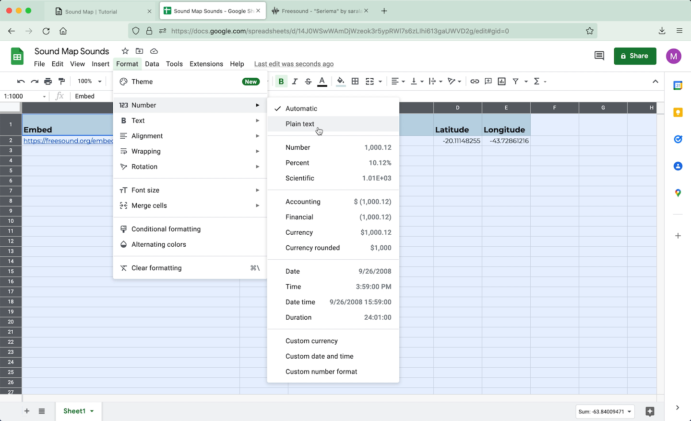
 

* O formato das células deve ser configurado como _Plain Text_ ou _Texto_. Para configurá-las, selecione todas as células e clique em:
> <b>>Formatar >Número >Texto</b>
  
  

---

 
  
## passo 4: publique sua planilha na web

 

  

     
   

    

        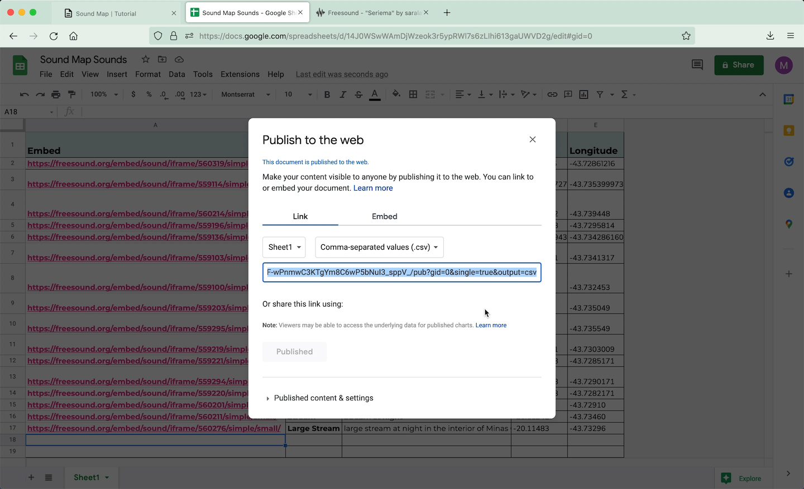
    

 

* Publique sua planilha na web. Clique em:
> <b>>Arquivo >Compartilhar >Publicar na Web</b>

* Selecione a aba (no exemplo "Sheet1") e selecione **.csv** como formato de saída. 
  
  

---

 
  
## passo 5: crie e configure seu mapa no uMap

 

  

     
   

    

        
    

 

* Acesse [uMap](http://umap.openstreetmap.fr/en/){:target="_blank"}  

* E clique em **"Create a Map"**
 

* Estilize e centralize onde quiser
  
  

---

 
  
## passo 6: insira os dados remotos

 

  

     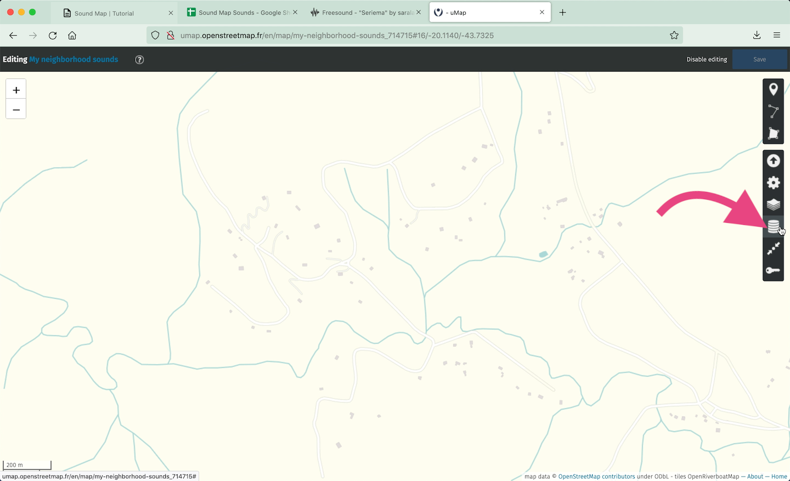
   

    

        
    

 

* Entre no modo de edição clicando no ícone do lápis (canto superior direito)

* Selecione o ícone das camadas

 

  

     
   

    

        
    

 

* Clique em **Remote Data**

* No campo **URL**, cole o link da sua planilha publicada na web como csv

 

  

        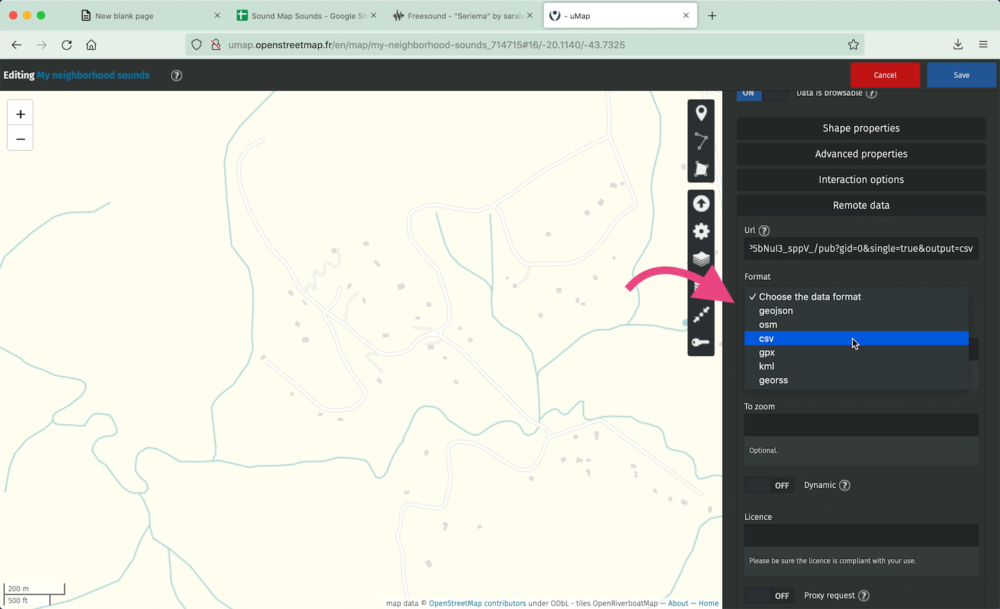
   

    

        
    

 

* No campo **FORMAT**, selecione csv

* Ative o modo **DYNAMIC**, para atualizar os dados a cada vez que a planilha é atualizadas

* Salve o mapa e atualize a página. Todos os pontos deveriam aparecer.
  
  

---

 
  
## passo 7: configure popups com players de audio

 

  

     
   

    

        
    

 

* Entre no modo de edição da camada 

* Clique em **Interaction Options**

* Preencha esse campo com o nome das colunas de sua planilha seguindo a seguinte formatação estabelecida pelo uMap.
> <u>dica.</u>: Todas as opções de formatação podem ser checadas clicando no ícone <b style="background-color:black; color:white;">?</b> icon 

* Certifique-se que os nomes estão escritos exatamente como constam na planilha

 
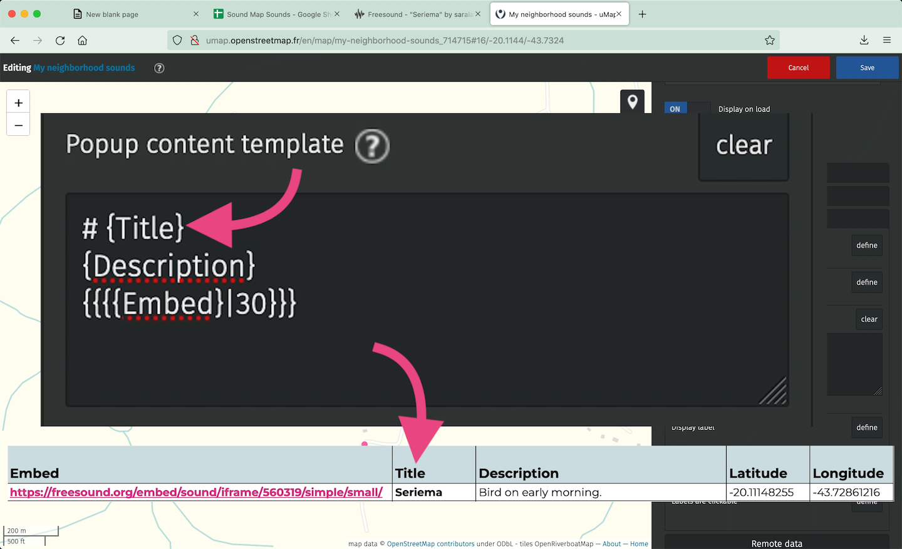
 

* Salve o mapa e atualize a página.
Agora os ponto, quando clicados, vão abrir um popup com um player.

 

  

Seu mapa está pronto!
 

--- 

 
  
## passo 8: compartilhe e incorpore seu mapa

 
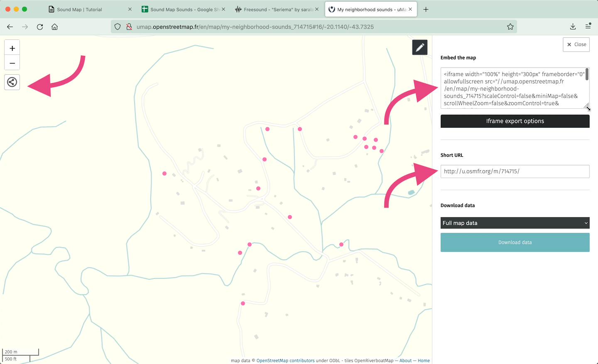
  

* Clique no botão de compartilhamento para copiar os códigos para:
> 1. Incorporar o mapa em outra página web 
> 2. E o link abreviado para acesso direto ao mapa  

 

  

     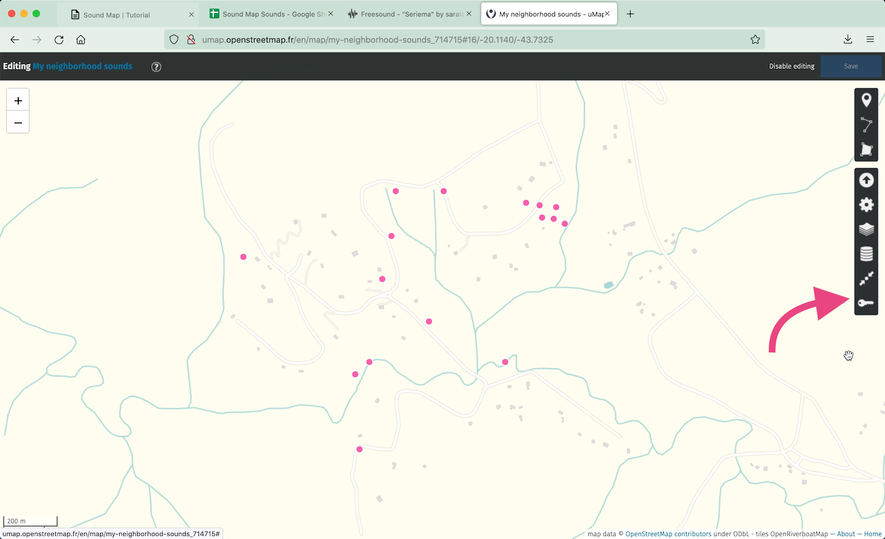
   

    

        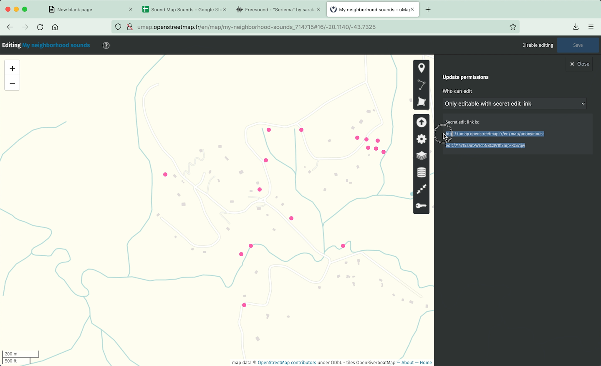
    

 

* Para editar seu mapa posteriormente, salve o link para edição: clique no ícone da chavinha, copie e salve o link fornecido.  
> * Se você está criando seu mapa logado em uma conta uMap, não se preocupe com essa etapa.*
  

--- 

 

## passo opcional: usado o player de audio nativo de seu navegador

Você também pode contruir seu mapa usando o player nativo de seu navegador, assim os sons serão tocados automaticamento ao abrir cada popup.

Nesse caso usaremos o link para acesso direto ao arquivo e não o link para incorporação.

 

  

     
   

    

        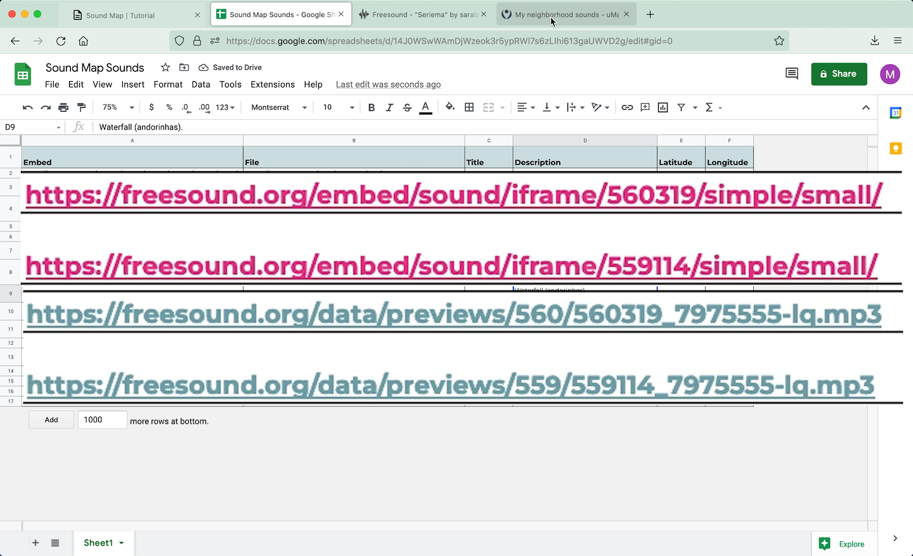
    

 

* Cada plataforma tem um caminho específico para as apastas de armazenamento. No caso do freesound, você pode usar o seguinte modelo:

> * Verifique o número do seu som/post no link incorporável:

> > <b><em>https://freesound.org/embed/sound/iframe/</em><em style="background-color:#ffdf3b; color:hotpink;">NUMERO_DO_ARQUIVO</em><em>/simple/small/</em></b>

> > <u>ex.</u>: <b><em>https://freesound.org/embed/sound/iframe/</em><em style="background-color:#ffdf3b;">560319</em><em>/simple/small/</em></b>

> * And apply it as the following link

> > <b><em>https://freesound.org/data/previews/</em><em style="background-color:#ffdf3b; color:hotpink;">3_PRIEMIROS_DIGITOS_DO_NUMERO_DO_ARQUIVO</em><em>/</em><em style="background-color:#ffdf3b; color:hotpink;">NUMERO_DO_ARQUIVO</em><em>_7975555-lq.mp3</em></b>

> > <u>ex.</u>: <b><em>https://freesound.org/data/previews/</em><em style="background-color:#ffdf3b" >560</em><em>/</em><em style="background-color:#ffdf3b">560319</em><em>_7975555-lq.mp3</em></b>

* Salve o mapa e atualize a página.
Os pontos, ao serem clicados, vão abrir um pop up com o player nativo. Os sons serão tocados automaticamente ao abrir cada popup.

 
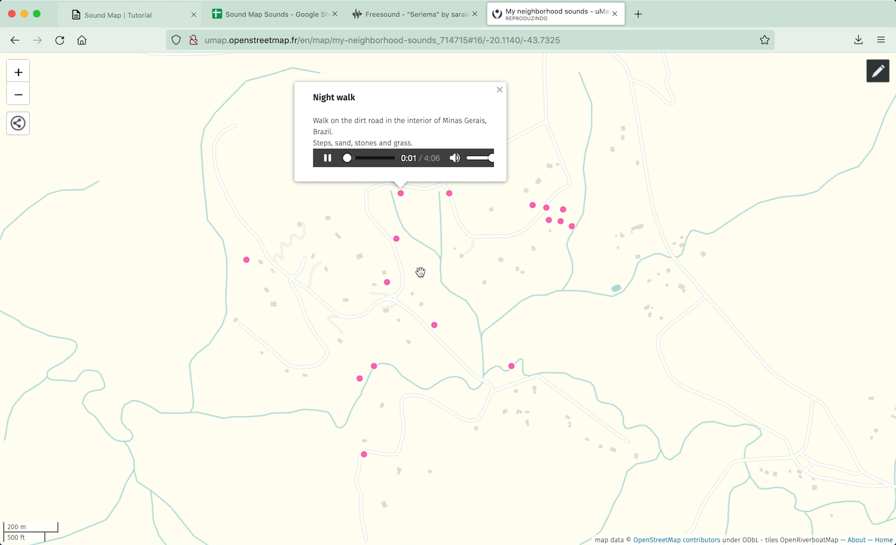
  

--- 

 

Outros links:

* [Mapas sonoros que já desenvolvi](https://saralana.xyz/my-maps){:target="_blank"} tanto para meus projetos, quanto para outr.s artistas - Nos últimos anos tenho usado a plataforma mapbox. Com essa ferramenta você terá mais liberdades para estilizar seu mapa, mas um conhecimento básico de desenvolvimento web será necessário (javascript, html, css). No link abaixo, compartilho um tutorial do mapbox ensinando como usar a ferramenta Sheetmapper, para integração de planilhas do google drive aos seus mapas. 

* [MAPBOX SHEETMAPPER](https://www.mapbox.com/impact-tools/sheet-mapper){:target="_blank"} 

E aqui alguns mapas sonoros que adoro:

* [aporee](https://aporee.org/maps/){:target="_blank"}  

* [sp sound map](http://www.spsoundmap.com/){:target="_blank"} 

* [cities and memory](https://citiesandmemory.com/){:target="_blank"} 

* [audiomapa](https://www.audiomapa.org/){:target="_blank"} 

 
 

Vou adorar conhecer seus mapas!!
Compartilhem comigo :)
Contato:
  
[https://saralana.xyz/sobre](https://saralana.xyz/sobre){:target="_blank"}