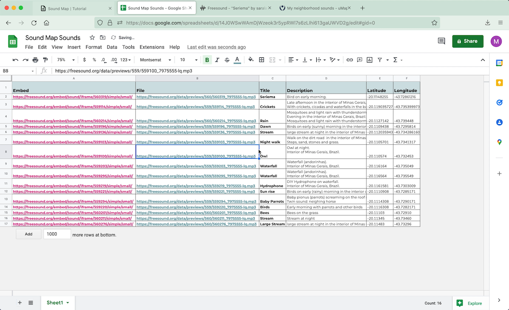

<iframe src="https://youtube.com/embed/5RfPWc047o8" frameborder="0" allow="accelerometer; autoplay; clipboard-write; encrypted-media; gyroscope; picture-in-picture" allowfullscreen></iframe>

  

> <b>Platforms:</b> 
         1. [uMap](http://umap.openstreetmap.fr/en/){:target="_blank"}  
         2. [freesound](https://www.freesound.org/){:target="_blank"} , [soundcloud](https://www.soundcloud.com/){:target="_blank"} , [spotify](https://www.spotify.com/){:target="_blank"} , [archive](https://www.archive.org){:target="_blank"} , [google drive](https://www.drive.google.com){:target="_blank"} or any other cloud, repository or streaming platform  
         3. [Google Sheets](https://docs.google.com/spreadsheets/){:target="_blank"}  
  

---

 
  
## step 1: Upload your sounds to a cloud, repository or streaming platform

 

 

* In this tuttorial we will build the map with sounds published on [freesound.org](https://www.freesound.org/){:target="_blank"} 

  

---
 
  
## step 2: Create a google spreadsheet with your sounds 

 

  

     
   

    

        
    

 

* It is important that the spreadsheet has two columns named as "Latitude" and "Longitude"

* The coordinates must be in **DECIMAL DEGREE SYSTEM**
> <u>ex.</u>: -20.11148255	-43.72861216

* Another column must contain a link to the embed link for your sounds.

* You should not use all the embed code, but only the link shown in quotes after "src="
 

* **IN FREESOUND** the embed code is  
> <b><em><iframe frameborder="0" scrolling="no" src="</em><em style="background-color:#ffdf3b;">https://freesound.org/embed/sound/iframe/560319/simple/small/</em><em>"width="375" height="30"></iframe></em></b>
  
> And the link that will be added to the spreadsheet is
 
> <b><em style="background-color:#ffdf3b;">https://freesound.org/embed/sound/iframe/560319/simple/small/</em></b>
  

* **IN SOUNDCLOUD** the embed code is  
> <b><em><iframe width="100%" height="166" scrolling="no" frameborder="no" allow="autoplay" src="</em><em style="background-color:#ffdf3b;">https://w.soundcloud.com/player/?url=https%3A//api.soundcloud.com/tracks/1011674683&color=%23ff43ad&auto_play=false&hide_related=false&show_comments=true&show_user=true&show_reposts=false&show_teaser=true</em><em>"></iframe></em></b>
  
> And the link that will be added to the spreadsheet is
 
> <b><em style="background-color:#ffdf3b;">https://w.soundcloud.com/player/?url=https%3A//api.soundcloud.com/tracks/1011674683&color=%23ff43ad&auto_play=false&hide_related=false&show_comments=true&show_user=true&show_reposts=false&show_teaser=true</em></b>

  

---
 
  
## step 3: configure the spreadsheet cells

 

 

* The cells format must be set as Plain Text. To configure it, select all the cells and click on:
> <b>>Format >Number >Plain text</b>
  
  

---

 
  
## step 4: publish your spreadsheet on web

 

  

     
   

    

        
    

 

* Publish your spreadsheet on web. Click on:
> <b>>File >Share >Publish to web</b>

* Select the tab (in the example "Sheet1") and select **.csv** as output format. 
  
  

---

 
  
## step 5: create and style your map on uMap

 

  

     
   

    

        
    

 

* Go to [uMap](http://umap.openstreetmap.fr/en/){:target="_blank"}  

* And click on **"Create a Map"**
 

* Style and center it as you want
  
  

---

 
  
## step 6: insert remote data

 

  

     
   

    

        
    

 

* Enter edition mode clicking on the pencil icon

* Select the layer icon

 

  

     
   

    

        
    

 

* Click on **Remote Data**

* In **URL** field, paste the link of your spreadsheet published on web as csv

 

  

        
   

    

        
    

 

* In **FORMAT** field, select csv

* And set **DYNAMIC** on, to fetch data each time the sheet is updated

* Save and reload your page. All the markers should appear.
  
  

---

 
  
## step 7: configure popups with audio players

 

  

     
   

    

        
    

 

* Enter again, in the Layer edition mode 

* Click on **Interaction Options**

* Fill it with the columns names of your sheet following text formatting of uMap.
> <u>tip.</u>: Check all the formatting options clicking on the <b style="background-color:black; color:white;">?</b> icon 

* Be sure that the names are written exactly as in the spreadsheet

 

 

* Save and reload your page.
The markers, when clicked, will show a popup with the freesound player inside it.

 

  

Your map is done!
 

--- 

 
  
## step 8: share or embed your map

 

  

* Click on the Share button to copy both:
> 1. The code to embed the map in a webpage, 
> 2. and the short URL link for your map  

 

  

     
   

    

        
    

 

* To edit your map later, save the edition link: click on the key icon, copy and save the link.  
> *If you are creating your map logged on a uMap account, you don't need to worry with this last step.*
  

--- 

 

## optional step: using the native audioplayer of your browser

You can also build your map with the native Audio player of your browser so the sounds will be played automatically when opening each popup.

In this case we need to use the file location link instead of it's embed player.

 

  

     
   

    

        
    

 

* To find its location on freesound, you can use the followin link model:

> * Pick your freesound post number on its embed link:

> > <b><em>https://freesound.org/embed/sound/iframe/</em><em style="background-color:#ffdf3b; color:hotpink;">FILE_NUMBER</em><em>/simple/small/</em></b>

> > <u>ex.</u>: <b><em>https://freesound.org/embed/sound/iframe/</em><em style="background-color:#ffdf3b;">560319</em><em>/simple/small/</em></b>

> * And apply it as the following link

> > <b><em>https://freesound.org/data/previews/</em><em style="background-color:#ffdf3b; color:hotpink;">FIRST_3_DIGITS_OF_FILE_NUMBER</em><em>/</em><em style="background-color:#ffdf3b; color:hotpink;">FILE_NUMBER</em><em>_7975555-lq.mp3</em></b>

> > <u>ex.</u>: <b><em>https://freesound.org/data/previews/</em><em style="background-color:#ffdf3b" >560</em><em>/</em><em style="background-color:#ffdf3b">560319</em><em>_7975555-lq.mp3</em></b>

* Save and reload your page.
The markers, when clicked, will show a popup with your browser native player. The sounds will automatically start as opening each popup.

 

  

--- 

 

Other links:

* [Sound maps I already developped](https://saralana.xyz/my-maps){:target="_blank"} - In the last years I've been using the Mapbox platform. With this tool you can have more possibilities to style your map, but basic web development knowledge is required (javascript, html, css). In the link below, I share a brief mapbox tutorial teaching how to use the Sheetmapper tool, which also allows you to create maps using data from Google Sheets. 

* [MAPBOX SHEETMAPPER](https://www.mapbox.com/impact-tools/sheet-mapper){:target="_blank"} 

And here some sound maps I love:

* [aporee](https://aporee.org/maps/){:target="_blank"}  

* [sp sound map](http://www.spsoundmap.com/){:target="_blank"} 

* [cities and memory](https://citiesandmemory.com/){:target="_blank"} 

* [audiomapa](https://www.audiomapa.org/){:target="_blank"} 

 
 

I would love to see your maps!
Please share it with me :)
Contact:
  
[https://saralana.xyz/about](https://saralana.xyz/about){:target="_blank"}