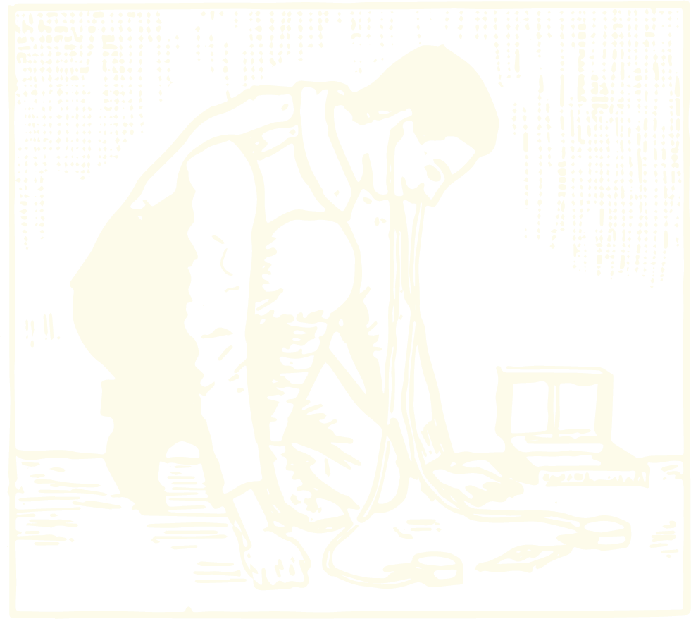
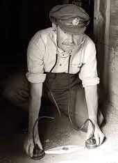
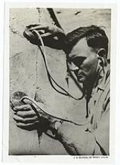
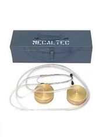
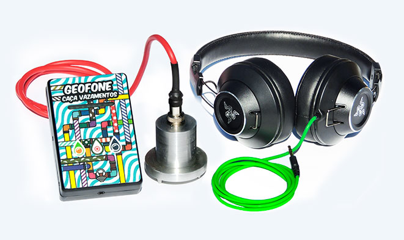
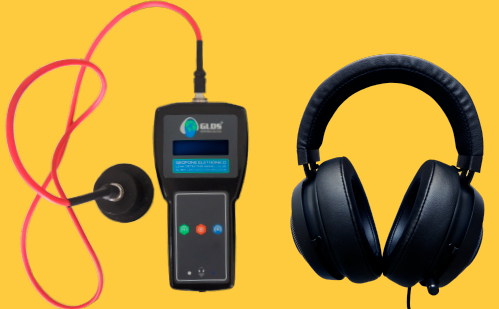
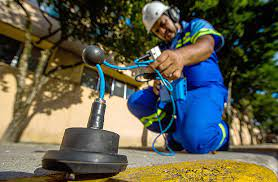
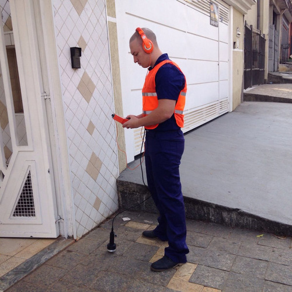
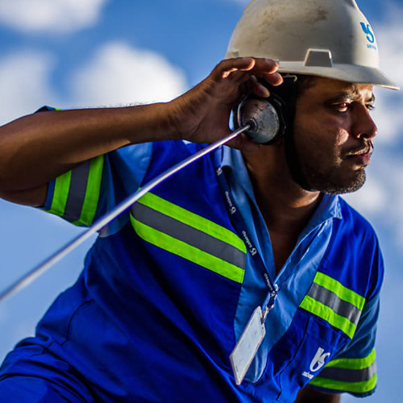
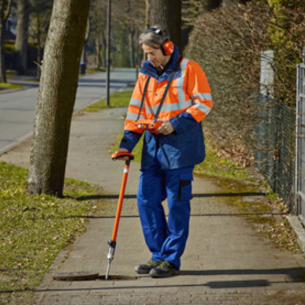

 
Para além dos músicos e radialistas, muitos ofícios que fazem uso da escuta como ferramenta principal de trabalho. Entre tantos ofícios pautados na acústica, os caçadores de vazamento são os que me despertam mais curiosidade, tanto pelo aparato que usam, o geofone, quanto por sua escuta minuciosa e atenta.

Um caçador de vazamentos busca a origem de infiltrações cujo o ponto de escape é desconhecido. Para isso fazem uso do geofone, um microfone de contato que capta o som dos movimentos na terra, nas paredes ou em qualquer superfície sólida.

Os sons captados podem parecer meros ruídos, mas os caçadores de vazamentos são capazes de interpretá-los e, através deles, descobrir o caminho das águas que estão infiltradas em muros, pisos e paredes.

No ano passado, na tentativa de construir [microfones de contato de baixo custo](https://saralana.xyz/hidrofone), estive em contato com vários fabricantes e usuários de microfones desse tipo. Logo conheci o geofone mecânico, uma espécie de estetoscópio gigante usada para detectar vazamentos. O aparato, que foi usado durante séculos, ainda é a ferramenta utilizada por alguns profissionais apesar da grande maioria já trabalhar com geofone digital.
O dispositivo atual não é menos interessante. A roupagem dada aos geofones digitais produzidos hoje, com cores vibrantes e ilustrações, lhes dá uma aparência de brinquedos.
Esse novo modelo também facilita a gravação dos sons e possibilita escutá-los novamente para análise posterior do rastreamento.

 

  

     
   

    

        
    

  

     
   

*geofones mecânicos, usados há séculos e que seguem em uso por alguns caçadores de vazamentos. Esses geofones são ainda comercializados e possuem inclusive fabricação brasileira, como o geofone da marca Mecaltec.*

 

  

     
   

    

        
    

  

     
   

*modelos atuais de geofone*

 

O projeto que vou desenvolver será construído a partir do convívio com esses caçadores: da escuta e gravação compartilhada com eles.

O resultado poderá ter diversas formas como uma peça sonora ou um vídeo sonoro.
Quero fazer uma colagem poética usando, não apenas os sons gravados por esses profissionais, como também fragmentos documentais  de sua prática, de seus experiências e relatos sobre sua percepção de escuta em demais momentos de seus cotidianos.

  

     
   

    

        
    

  

     
   

  

Um exemplo de colagem é a peça [orelhinha](https://saralana.xyz/orelhinha), que compus utilizando vozes gravadas e outros sons relacionados à temática da telefonia pública.

Como artista e engenheira, me interessa muito o uso para finalidades artísticas, de aparatos e ferramentas criadas para aplicações técnicas na eletrônica, construção civil, hidráulica, laboratoriais e etc. Gosto de perverter suas utilidades (como fiz em [Corra e Olhe o Céu](https://saralana.xyz/corra-e-olhe-o-ceu)) ou questionar a real necessidade de seu uso (como faço em [Pontos Cegos](https://saralana.xyz/pontos-cegos)).

 