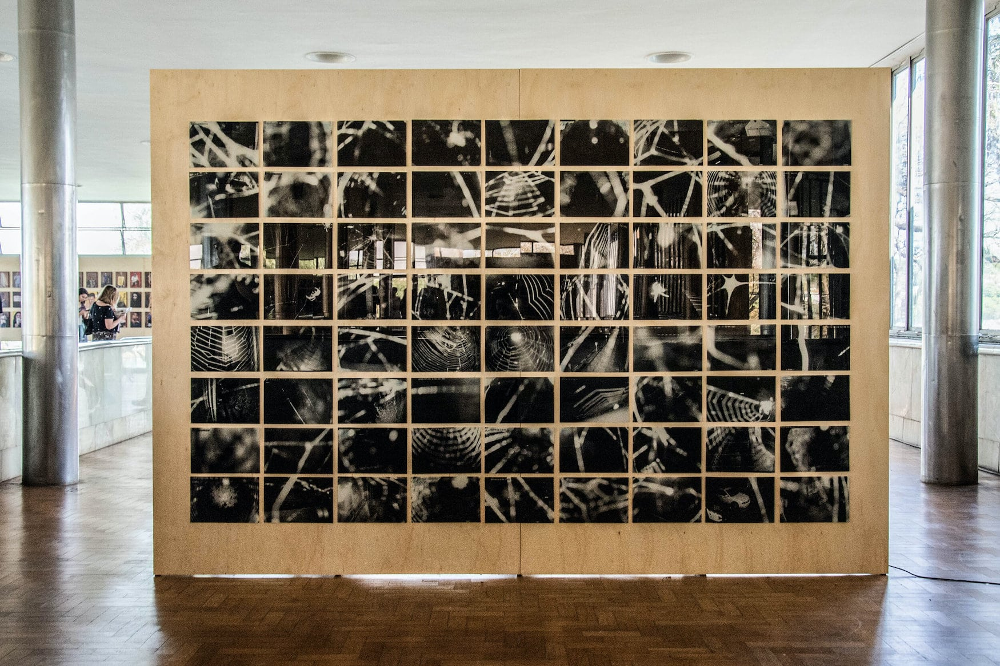

<a href="#notas">Abaixo notas sobre videovigilânccia, privacidade e o contorno conceitual do projeto</a>

 

    

        
<iframe src="https://player.vimeo.com/video/689833349#t=48m44s?h=9e075bf729&amp;badge=0&amp;autopause=0&amp;player_id=0&amp;app_id=58479" frameborder="0" allow="autoplay; fullscreen; picture-in-picture" allowfullscreen style="position:absolute;top:0;left:0;width:100%;height:100%;" title="esp&amp;eacute;cies de espa&amp;ccedil;os II | algumas coletas de 2021"></iframe>

        
    

        

          
O conjunto de imagens ao lado nos oferece a visão sobre uma ocupação aparentemente inofensiva de aranhas. O dado importante sobre estas imagens é que elas são registros realizados por câmeras de vigilância. 

        
São incontáveis as câmeras que tiveram suas gravações inviabilizadas graças às aranhas que tramaram teias na frente desses aparatos.

        
Em disputa pelas quinas, habitat natural de artrópodes e de câmeras, as aranhas  tornam-se espontâneos agentes de contra-vigilância.

        
Essa coleção de imagens é um fragmento do segundo trabalho da série Espécies de Espaços, uma investigação artística iniciada em 2019, que parte da apropriação de imagens capturadas por câmeras de vigilância, para criação de instalações, vídeos e séries fotográficas.

        
Durante a residência cidade floresta, tenho como foco desdobrar esse projeto e pesquisar, com a colaboração de aranhas e biólogos, a ação contra-vigilante de aranhas. Quero intervir em câmeras para transformá-las em ambientes mais atrativos para aranhas e, consequentemente, impossibilitando o adequado registro de seus vídeos. Tornando, portanto, tais aparatos disfuncionais para a vigilância e garantindo a privacidade de pessoas monitoradas.

        

    

  

### INTERAÇÕES BIOLÓGICAS INTERESPECÍFICAS

Embora essas aranhas involuntariamente ajudem os humanos com suas teias, **a interação com pessoas vigiadas não beneficia ou prejudica os artrópodes.** 

Assumindo a relação entre aranhas e humanos vigiados como uma interação biológica interespecífica, é possível argumentar que a relação presente é o **inquilinismo/comensalismo**: interação em que membros de uma espécie ganham benefícios enquanto os de outra espécie não se beneficiam nem são prejudicados: os humanos  vigiados se beneficiam da proteção das teias, mas as aranhas 
não se beneficiam de tecer suas teias especificamente na frente das câmeras.

Proponho, portanto, transformar essa interação para garantir que as aranhas também se **beneficiem**. Criar ambientes, para que a interação biológica passe do **comensalismo/inquilinismo** para a **mutualismo/protocooperação**, uma interação vantajosa para ambas as espécies.

Nas etapas a seguir, proponho algumas ações que visam reconfigurar essa interação biológica para que as aranhas também se beneficiem da construção de suas teias em frente às câmeras. 

Algumas etapas já estão em andamento mas devem seguir em desenvolvimento durante a residência e mentoria das cientistas da participantes da **cidade floresta** .

 

    

      <b>1. Constante monitoramento de câmaras online</b> 
      
Gravação de teias e sua construção. Desde que iniciei esse projeto, em 2019, sigo  coletando videos de aranhas tecendo teias em frente a circuitos de videovigilância. A partir de agora, terei como foco a coleta de imagens de câmeras instaladas no <b>Rio de Janeiro</b>.

         
    

    

      
        
      <b>2. Identificação de espécies</b>
      
Para as primeiras espécies identificadas, contei com a colaboração dos biólogos e aracnólogos Pedro Martins e Alexandre Stamato Michelotto. O reconhecimento de espécies é realizado partindo do estudo comportamental, localização geográfica das câmeras (encontradas através do número IP usado para acessá-las) e padronagem de teias. Os aracnídeos já identificados, são em grande parte aranhas sinantrópicas, que vivem em meio urbano, pertencentes às famílias Araneidae, Theridiidae e Uloboridae, que fazem teias suspensas orbiculares - representadas ao lado.

      
Apesar de estar em andamento essa é uma etapa da pesquisa que deverá seguir em desenvolvimento durante a residência e, se possível, contar com a colaboração de outros biólogos familiarizados com os artrópodes dessa região.

       
    

**3. Interferências** 

Igualmente com a colaboração de biólogos e aracnólogos, durante a residência quero pesquisar possíveis interferências nas câmeras que poderiam beneficiar e atrair aranhas. 

A pesquisa será iniciada fazendo um levantamento de espécies mais frequentes na região e, a partir de seus hábitos e características, criar estratégias para aproximação. 
As aranhas também poderiam ser atraídas indiretamente, ao fazer intervenções que tenham como foco atrair primeiro suas presas, criando um ambiente propício e vantajoso para que as elas se instalem. 
Cito algumas possibilidades ou pontos de partida:
* Criar um perfume de odores ou feromônios para atrair aranhas ou insetos que compõem a dieta dos aracnídeos.
* Instalar luzes leds com frequências/cores atrativas; 
* Alterar a temperatura também através do uso de luz infravermelho (fora do espectro visível para humanos);
É importante que as câmeras sigam funcionando mesmo após as intervenções. Busco, por tanto, alterações discretas ou invisíveis que não danifiquem os aparatos.

    

      
    

    

      
    

    

      
    

**4. Testes e validação** 

Aplicação experimental para avaliação de eficácia das interferências para atrair insetos e aranhas.

 
**5. Localização**

Buscar, online, mais câmeras com livre acesso no Rio de Janeiro e determinar a localização geográfica delas a partir da imagem captada (ruas, paisagens) e do cruzamento de informações de acesso (nº de IP).

 
**6. Intervenção em câmeras previamente instaladas na cidade e  gravação** 

Registrar a chegada dos insetos e aranhas, atraídas por essas câmeras.

 

---

 

## APRESENTAÇÃO

No primeiro momento desse projeto, durante a residência do Bolsa Pampulha de 2019, a pesquisa foi [apresentada](../en/especies-de-espacos-2){:target="_blank"} no Museu de Are da Pampulha – BH – MG,  como uma série de frames impressos em vidro (imagens abaixo).

Para essa etapa proponho apresentar, pela primeira vez, no formato de vídeo multicanal, com dezenas de gravações de teias de aranhas sendo tecidas. Os vídeos podem serão apresentados em TV’s, projetor ou pequenas telas dispostas em um grid. Também gostaria de oferecer aos visitantes ou participantes da apresentação, um kit com amostras dos produtos e ferramentas usadas para intervir nas câmeras.

Neste [link](https://vimeo.com/showcase/6270742){:target="_blank"} apresento exemplo de vídeos já coletados.

 

    

      
    

    

        

            
        

    

  
 

---

  

## NOTAS SOBRE VIDEOVIGILÂNCIA E PRIVACIDADE

Espécies de Espaços é uma investigação artística iniciada em 2019, que parte da apropriação de imagens capturadas por câmeras de vigilância, para criação de instalações, vídeos e séries fotográficas. O 4º trabalho dessa série, é a proposta que apresento para esse edital. 

O título desse trabalho é uma referência direta ao livro de Georges Perec, <b><i>Espéces d'Espaces</i></b>, em que ele, na tentativa de ler os lugares que permeiam seu cotidiano, descreve os espaços onde vive. Afinal, <b><i>"viver é passar de um espaço ao outro tentado, ao máximo, não esbarrar"</i></b>.

O arquivo de imagens gerados por câmeras de vigilância, tem proporções incomensuráveis e guarda vídeos que não são feitos para a apreciação pública. No entanto, esse trabalho reconhece o potencial poético desses registros, que estão também impregnados de fortes características do nosso tempo e assim consolidam um testemunho relevante para a construção da narrativa de nossa história presente.

Importante destacar que **teia**, em inglês **web** é também a palavra usada para nomear a grande rede que nos conecta globalmente: a world wide web. Todas as imagens que coleto estão disponíveis na internet. Tenho acesso a elas utilizando senhas padrão estabelecidas pelos fabricantes dessas câmaras, que muitas vezes, por negligência de seus usuários, nunca foram alteradas e, em geral, são muito simples como  “12345”).

Nas últimas décadas, com o advento da eletrônica digital, sua disseminação e monopólio por grandes empresas com duvidosos interesses político-sociais-financeiros, levou à sua utilização como instrumento de submissão e aprisionamento da sociedade. Novos padrões de consumo foram impostos, ditados por um tempo acelerado de atualizações constantes e rápida obsolescência. Paralelamente, nossa dependência a essas tecnologias se agrava, alienando-nos e nos adestrando na técnica e na criação. 

A videovigilância, sendo um recurso tecnológico de controle social, está intrinsecamente associada a esse contexto. Vigilância, essa, agravada diante das recentes medidas de controle tomadas por governos, sob a justificativa de contenção da pandemia. Considerando sua crescente expansão, em termos de alcance social e de novas funcionalidades a ela associadas, se torna urgente um recuo “tecnocrítico”. 

O que significa ver e ser visto considerando a notável a penetração da videovigilância no nosso cotidiano? Como compreender esse novo desenho de fronteiras entre o público e o privado? E, por último, como garantir o direito à proteção de imagens e dados em uma sociedade ao mesmo tempo dependente dessas tecnologias e por elas alienada ?

Essas são indagações que provocam não somente essa pesquisa como também outros de meus projetos que trazem também uma reflexão sobre algumas disfuncionalidades da hiper-vigiada sociedade em que vivemos.

Busco, também, com essa pesquisa, interpretar pelo viés da ecologia, a interação entre corpos físicos (aranhas), corpos tecnológicos (câmeras) e corpos culturais (vigilância). 

 

---

  

## REFERÊNCIAS

* Fritz Vollrath and Paul Selden - The Role of Behavior in the Evolution of Spiders, Silks, and Webs - 2007

* Blackledgea,1, Nikolaj Scharffb, Jonathan A. Coddingtonc, Tamas Szu ̈ tsb, John W. Wenzeld, Cheryl Y. Hayashie, and Ingi Agnarssona - Reconstructing web evolution and spider diversification in the molecular era Todd A. - 2009

* Witzany, G. (2000) Life: The Communicative Structure. Norderstedt, Libri.

* Bruno, Fernanda – Máquinas de ver, modos de ser: Vigilância, tecnologia e subjetividade – 2013

 