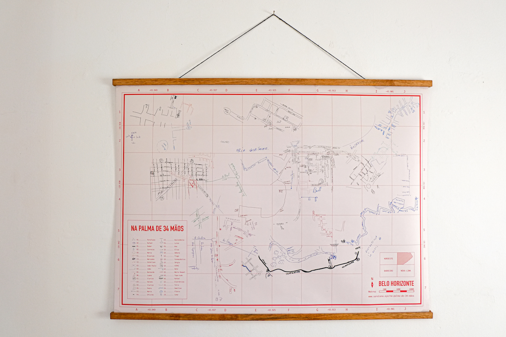

 
 

  
  
  
 
  <iframe src="../na-palma-de-34-maos" height="200" width="100%" style="border:0px" scrolling="no"></iframe>
  

  

*Clique [aqui](../na-palma-de-n-maos){:target="_blank"} para abrir o mapa em outra aba.*
   
Partindo do beco do Espai, localizado no bairro Santa Efigênia, em Belo Horizonte, pedi a transeuntes,  vendedores e amigos com quem me encontrava, mapas rascunhados à mão para me orientar sobre rotas de saída dos lugares  onde estávamos, sem entretanto dizer para onde eu gostaria de ir. O final de cada mapa desenhado era o ponto de partida para um novo caminho.  

Os mapas desenhados à mão são vetorizados, reescalonados e projetados sobre o mapa geográfico de Belo Horizonte, fazendo uma  colagem e criando uma nova cartografia da cidade.
  

**Curadoria:** Marcelo Drummond e Janaina Melo

**Participantes:** transeuntes, Elisa Lana, João Paulo Costa, Bernardo Esteves, Tiago Esteves, Ana Esteves, Clarice Lacerda, Clarice Rodrigues, Luana Lorenzini, Mercedes Valadares, Helena Reis, Débora da padaria, Sérgio cheveiro, vendedores da Casa dos Parafusos, funcionárias dos Correios (unidade Raul Soares – BH), Maria Raquel Dias, alunas do Colégio Santa Dorotéia, Hamilton Reis, Rafael Reis, Túlio Jorge, Rafael Pimenta, Edimilson, Drogaria do Dias e Flávia Mafra.
  

  

  

  
---
  
  
 

## Montagem na parede:

  

  

  
---
  
 

## Mapa dobrável:

  

  

  
---
  
 

## Processo: